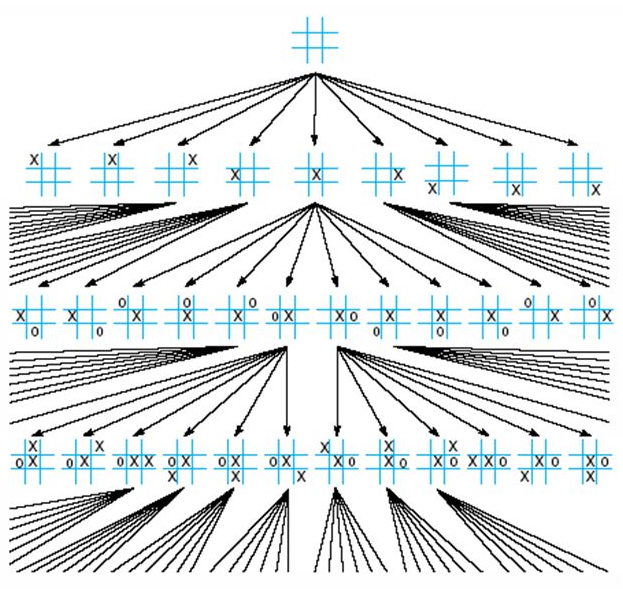
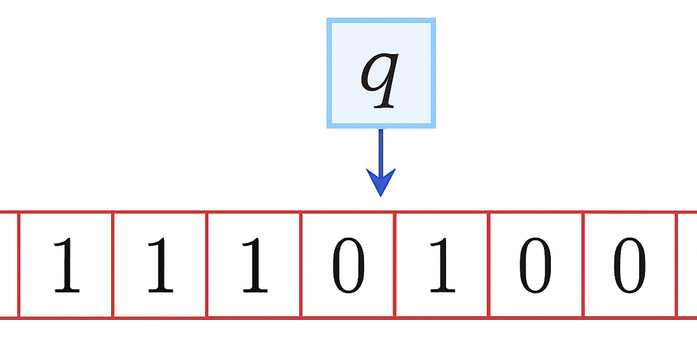
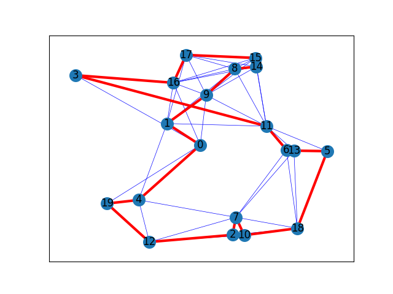
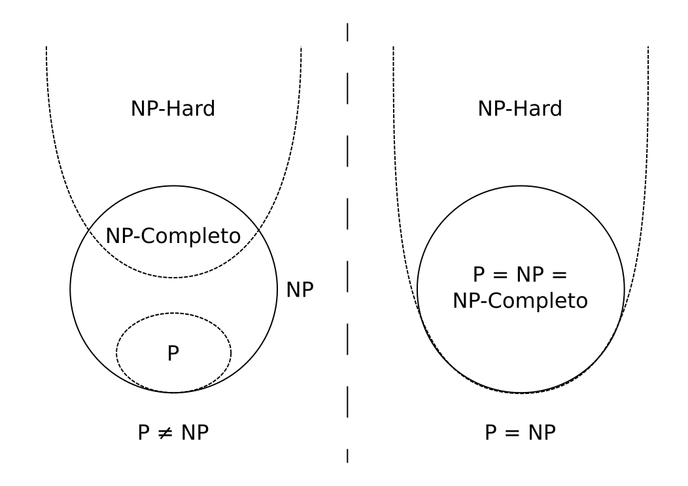

<!-- _class: lead -->

# IPD434 - Seminario de Soft Computing
## Introducción a Soft Computing: Complejidad, búsqueda y aproximación

Dr. Patricio Olivares Roncagliolo
Universidad Técnica Federico Santa María

---

## Introducción

La presentación del curso planteó tres mecanismos para construir soluciones aproximadas en problemas complejos:

$$
\text{imprecisi\'on}\rightarrow\text{l\'ogica difusa},\qquad
\text{b\'usqueda}\rightarrow\text{evoluci\'on},\qquad
\text{predicci\'on}\rightarrow\text{redes neuronales}
$$

Esta unidad muestra cuándo una solución exacta puede ser prohibitiva frente a un modelo aproximado y evaluable.

Antes de elegir una técnica se debe entender qué hace difícil al problema.

---

## Objetivos de la unidad

Al finalizar esta unidad se espera poder:

1. **Explicar** qué caracteriza a Soft Computing.
2. **Representar** un problema mediante estados, soluciones y transformaciones.
3. **Distinguir** búsqueda completa e incompleta.
4. **Relacionar** computabilidad y complejidad con la necesidad de aproximar.
5. **Diferenciar** las clases P, NP, NP-completo y NP-hard.
6. **Justificar** una técnica aproximada sin confundir viabilidad con optimalidad.

---

## Soft Computing

El término fue introducido por [Lotfi A. Zadeh](#referencia-zadeh) para agrupar técnicas tolerantes a:

- imprecisión.
- incertidumbre.
- verdad parcial.
- aproximación.

---

## Soft Computing

Soft Computing complementa a los métodos exactos. No afirma que toda aproximación sea aceptable.

La aproximación se justifica cuando reduce el costo o permite tratar la incertidumbre sin perder la calidad necesaria para la decisión.

La meta es obtener soluciones tratables, robustas y de bajo costo cuando una formulación exacta resulta innecesaria o impracticable.

---

## Tres ejemplos cotidianos

**Estacionar un automóvil**

Se decide con estimaciones graduales: "muy cerca", "ángulo suficiente", "girar poco".

**Reconocer escritura**

Se clasifica aunque cada carácter difiera de una plantilla ideal.

**Buscar alimento**

Una colonia de hormigas explora y refuerza rutas sin un controlador central.

**Idea común**

La solución emerge desde información parcial, experiencia o interacción.

---

## Componentes principales

| Familia | Representación | Mecanismo | Resultado |
|---|---|---|---|
| Lógica difusa | Grados de pertenencia y reglas | Aplicar reglas sobre grados de pertenencia | Decisión gradual |
| Redes neuronales | Parámetros y capas | Optimización desde datos | Función aprendida |
| Algoritmos evolutivos | Población de candidatos | Selección y variación | Solución aproximada |
| Sistemas híbridos | Combinación de las anteriores | Aprendizaje e inferencia | Compromiso entre capacidades |

---

## Formalizar el problema

Un problema descrito en lenguaje natural debe traducirse a una definición operativa antes de aplicar una técnica.

- **Estados $S$:** configuraciones posibles.
- **Estado inicial $s_0$:** punto de partida.
- **Acciones $A(s)$:** cambios permitidos.
- **Término:** cuándo detenerse.
- **Criterio $f$:** cómo evaluar una solución.

La formalización no es única: cambia el tamaño de $S$, las restricciones visibles y el costo de evaluar una solución.

---

## Ejemplo: ahorcado

Representar el estado como $s=(p,L,e)$, donde $p$ es el patrón visible, $L$ las letras intentadas y $e$ los errores.

| Elemento | Representación |
|---|---|
| Estado | patrón visible $p$, letras intentadas $L$ y errores $e$ |
| Inicial | palabra oculta, $L=\varnothing$ y $e=0$ |
| Acciones | elegir una letra no intentada |
| Término | se descubre la palabra o se alcanza el máximo de errores |
| Criterio | ganar con menos errores o intentos |

- Si la letra pertenece a la palabra, se revelan todas sus apariciones.
- Si no pertenece, aumenta $e$.

---

## Ejemplo: ahorcado

$$
(\_\,A\,\_\,A,\{A\},0)
\xrightarrow{\text{elegir }C}
(C\,A\,\_\,A,\{A,C\},0)
$$

El jugador decide con información incompleta: conoce el patrón visible y los intentos anteriores, pero no la palabra secreta.

---

## Ejemplo: tres en línea

Cada jugada transforma un estado del tablero. Aún en este caso pequeño aparecen:

- estados válidos e inválidos.
- estados terminales.
- ramas equivalentes por simetría.
- decisiones condicionadas por un adversario.

Actividad: formalice el tres en línea como en el ejemplo anterior: estado del tablero y turno, acciones válidas y condiciones de término.

---

## Crecimiento del espacio

Sea $S$ el conjunto de estados posibles de un problema. Si cada estado se representa mediante $n$ componentes y cada componente puede tomar $k$ valores:

$$
|S|=k^n
$$

**$|S|$:** número bruto de configuraciones.

---

### Ejemplo: tres en línea

Cada estado se representa mediante las nueve casillas del tablero:

$$
s=(x_1,x_2,\ldots,x_9),
\qquad
x_i\in\{\varnothing,X,O\}
$$

Por lo tanto:

$$
n=9,\qquad k=3,\qquad |S|=3^9=19\,683
$$

Este es un conteo bruto: incluye configuraciones inválidas o que no pueden alcanzarse durante una partida real.

---

## Ejemplo: tres en línea

---

## Búsqueda completa e incompleta de soluciones

**Completa**

- Puede demostrar optimalidad o inexistencia.
- Recorre sistemáticamente el espacio relevante.
- Su costo puede crecer de manera prohibitiva.

**Incompleta**

- Explora una fracción del espacio.
- Depende de heurísticas y parámetros.
- Busca calidad suficiente con recursos limitados.

**Completa** describe una garantía de cobertura o solución, no necesariamente un algoritmo rápido. 
**Incompleta** no demuestra optimalidad o inexistencia. Debe reportar calidad, variabilidad y presupuesto computacional.

---

## De la búsqueda a la complejidad

La búsqueda completa o incompleta describe cómo un algoritmo explora el espacio de estados.

Pero también interesa estudiar cómo aumentan los recursos necesarios cuando crece el tamaño de la entrada:

$$
n \uparrow
\quad\Longrightarrow\quad
\text{tiempo y memoria necesarios}
$$

Para comparar algoritmos sin depender de un computador particular, se utiliza un modelo matemático común de computación.

La máquina de Turing permite formalizar qué problemas pueden resolverse y cuánto trabajo computacional requieren.

---

## Máquina de Turing

Una máquina de Turing es un **modelo matemático de computación** que representa la ejecución paso a paso de un algoritmo.

A partir de una entrada, la máquina aplica un conjunto finito de reglas hasta detenerse o continuar indefinidamente.

Cuando el problema se formula como una pregunta de tipo **sí/no**, la máquina puede terminar en dos tipos de resultado:

- **acepta** la entrada si la respuesta es **sí**
- **rechaza** la entrada si la respuesta es **no**

---

## Máquina de Turing

Por ejemplo, para un tablero de tres en línea:

$$
\text{¿el jugador }X\text{ tiene una línea ganadora?}
$$

La máquina **acepta** si el tablero contiene tres $X$ en línea y **rechaza** si no ocurre.

$$
\text{entrada}
\longrightarrow
\text{secuencia de pasos}
\longrightarrow
\text{aceptar, rechazar o no detenerse}
$$

No representa un computador específico. Proporciona un modelo común para estudiar qué problemas pueden resolverse y cuántos pasos requiere resolverlos.

---

## Máquina de Turing

El modelo de Turing formaliza una máquina con cinta, cabezal, estados y reglas de transición.

$$
\delta:Q\times\Gamma\rightarrow\Gamma\times\{L,R\}\times Q
$$

donde $Q$ es el conjunto de estados y $\Gamma$ el alfabeto de la cinta.

El artículo original de Turing de 1936 está disponible en `../../Material/Turing_Paper_1936.pdf`.

---

## Reglas de transición

Una máquina de Turing avanza entre configuracioes mediante reglas de transición.

$$
\delta:Q\times\Gamma
\rightarrow
\Gamma\times\{L,R\}\times Q
$$

La función $\delta$ recibe:

- un estado actual $q\in Q$
- el símbolo leído $a\in\Gamma$

A partir de esa información indica:

- el símbolo que se escribirá en la cinta
- dirección $D$ seleccionada para el cabezal ($L$ o $R$)
- el nuevo estado de la máquina

$$
\delta(q,a)=(b,D,q')
$$
---

## Determinismo y no determinismo

### Determinista

Para cada combinación $(q,a)$ existe como máximo una transición posible.

$$
\delta(q,a)=(b,D,q')
$$

La ejecución sigue una única secuencia de configuraciones.

$$
s_0\rightarrow s_1\rightarrow s_2\rightarrow\cdots
$$

### No determinista

Para una misma combinación $(q,a)$ pueden existir varias transiciones posibles.

$$
\delta(q,a)=
\left\{
(b_1,D_1,q_1),
(b_2,D_2,q_2),
\ldots
\right\}
$$

Cada transición da origen a una posible secuencia de ejecución.

El no determinismo describe un modelo teórico en el que una misma configuración puede tener varias continuaciones posibles.

---

## Clase P

La clase **P** reúne problemas de decisión (sí o no) que pueden ser resueltos por una **máquina de Turing determinista** usando una cantidad de pasos que crece de forma **polinómica** con el tamaño de la entrada.

Para una entrada de tamaño $n$, el tiempo requerido está acotado por una expresión del tipo:

$$
n^k
$$

donde $k$ es una constante.

P representa problemas de decisión resolubles de manera eficiente en el modelo teórico de computación.

---

## Clase NP

La clase **NP** reúne problemas de decisión (sí o no) donde una respuesta afirmativa puede **verificarse** en tiempo polinómico.

Para una entrada de tamaño $n$, la verificación debe estar acotada por una expresión del tipo:

$$
n^k
$$

donde $k$ es una constante.

NP representa problemas donde una solución propuesta puede comprobarse de manera eficiente en el modelo teórico de computación.

---

## Clase NP

Por ejemplo, puede ser difícil encontrar una ruta de viaje, pero verificar una puede ser mucho más simple.

NP significa "polinómico no determinista", no "no polinómico".

---

## NP-completo

Un problema $A$ es **NP-completo** si:

1. $A\in NP$.
2. todo problema $B\in NP$ se reduce a $A$ en tiempo polinómico.

Papers base:
  * Todo SAT es NP-Completo. Stephen Cook, The complexity of theorem-proving procedures. 1971. https://dl.acm.org/doi/10.1145/800157.805047
  * 21 Problemas NP-Completos. Richard Karp, Reducibility Among Combinatorial Problems, 1972. https://cgi.di.uoa.gr/~sgk/teaching/grad/handouts/karp.pdf

---

## NP-Hard

Se les llama problemas **NP-Hard** a aquellos que, si bien **no necesariamente** se encuentran en el conjunto NP, pueden llegar a ser **tan difíciles** como los problemas más complejos de NP.

**Formalmente:** Un problema es **NP-Hard** si un problema **NP-Completo** puede reducir a él.

---

## Decisión y optimización en TSP

El **TSP** o **problema del vendedor viajero** (Travelling Salesman Problem) consiste en encontrar una ruta que visite un conjunto de ciudades exactamente una vez y vuelva al punto de inicio.

Cada conexión tiene un costo, por ejemplo distancia, tiempo o dinero.

---

## Decisión y optimización en TSP

- **Decisión:** ¿existe una ruta de costo menor o igual que $K$?
- **Optimización:** ¿cuál es la ruta de costo mínimo?
- **Verificación:** dada una ruta, su costo se calcula sumando sus conexiones.

Buscar la mejor ruta puede ser difícil, pero verificar el costo de una ruta propuesta es sencillo.

---

## Decisión y optimización en TSP

El problema de decisión es NP-completo. La versión de optimización es NP-hard.

Esta distinción importa al comunicar resultados: una metaheurística puede mejorar recorridos, pero no demuestra que el mejor recorrido hallado sea óptimo.

---

## ¿P = NP?

No se conoce si $P=NP$. Si un problema NP-completo tuviera un algoritmo determinista polinómico, entonces todos los problemas de NP también lo tendrían.

Soft Computing no resuelve P versus NP. Ofrece estrategias prácticas para buscar cuando el método exacto no es viable.

---

## Cómo justificar una aproximación

1. Definir calidad de solución y restricciones.
2. Identificar el tamaño y estructura del espacio.
3. Explicar por qué el método exacto no es viable o necesario.
4. Fijar un "presupuesto" de tiempo o evaluaciones.
5. Comparar con una línea base.
6. Repetir el experimento si existe aleatoriedad.
7. Reportar el mejor resultado y su distribución.

$$
\text{valor de la aproximaci\'on}
=\text{calidad obtenida bajo recursos limitados}
$$

El presupuesto puede expresarse en tiempo, memoria o número de evaluaciones. Para comparar métodos, debe mantenerse equivalente.

---

## Síntesis

- Soft Computing tolera imprecisión y aproximación para lograr tratabilidad y robustez.
- El espacio de búsqueda y la representación condicionan la dificultad.
- P, NP, NP-completo y NP-hard describen relaciones formales entre problemas.
- Una heurística produce candidatos. La evidencia determina si son útiles.
- La aproximación debe justificarse con métricas y presupuesto.

La próxima unidad reemplaza la verdad binaria por grados de pertenencia para representar conceptos lingüísticos e imprecisos.

---

## Referencias y material complementario

- A. M. Turing, "On Computable Numbers, with an Application to the Entscheidungsproblem", 1936. Disponible en `../../Material/`.
- S. A. Cook, "The Complexity of Theorem-Proving Procedures", 1971.
- R. M. Karp, "Reducibility Among Combinatorial Problems", 1972.
- L. A. Zadeh, "Fuzzy Logic, Neural Networks, and Soft Computing", 1994.
