<!-- _class: lead -->

# IPD434 - Seminario de Soft Computing
## Sistemas difusos: De conceptos lingüísticos a decisiones numéricas

Dr. Patricio Olivares Roncagliolo 

---

## Introducción a Soft Computing

Soft Computing admite soluciones aproximadas cuando una frontera exacta no representa bien el problema.

¿A qué temperatura una habitación deja de ser "tibia" y pasa a ser "calurosa"?

**Conjunto clásico**

$$
\chi_A(x)\in\{0,1\}
$$

**Conjunto difuso**

$$
\mu_A(x)\in[0,1]
$$

La lógica difusa modela gradualidad.

---

## Objetivos de la unidad

Al finalizar se espera poder:

1. **Definir** conjuntos difusos y funciones de pertenencia.
2. **Aplicar** operaciones, relaciones y composición max-min.
3. **Construir** variables lingüísticas y reglas difusas.
4. **Explicar** las etapas de un sistema de inferencia.
5. **Calcular** una salida mediante agregación y desfusificación.
6. **Implementar y validar** un controlador Mamdani con Scikit-Fuzzy.

---

## Conjunto difuso

Un conjunto difuso $A$ sobre un universo $X$ se representa por:

$$
A=\{(x,\mu_A(x))\mid x\in X\}
$$

donde $\mu_A(x)$ expresa el grado en que $x$ satisface el concepto representado por $A$.

Ejemplo: para el concepto "temperatura alta", $\mu_{alta}(28)=0.8$ significa pertenencia parcial, no una probabilidad de $80\%$.

La función de pertenencia se define para un concepto y un contexto concretos: $28\ ^\circ\mathrm{C}$ puede ser "alto" para una habitación, pero no para un horno industrial.

---

## Propiedades descriptivas

Para un conjunto difuso $A$:

- **Soporte:** $\operatorname{supp}(A)=\{x\mid\mu_A(x)>0\}$.
- **Núcleo:** $\operatorname{core}(A)=\{x\mid\mu_A(x)=1\}$.
- **Altura:** $h(A)=\sup_x\mu_A(x)$.
- **Normalidad:** $A$ es normal si $h(A)=1$.
- **Corte $\alpha$:** $A_\alpha=\{x\mid\mu_A(x)\ge\alpha\}$.

Los cortes $\alpha$ permiten estudiar un conjunto difuso mediante familias de conjuntos clásicos.

Por ejemplo, el corte $A_{0.8}$ reúne los elementos que cumplen el concepto con grado al menos $0.8$. Al aumentar $\alpha$, el conjunto resultante no puede crecer.

---

## Funciones de membresía

Una función de membresía puede ser cualquier función del tipo:

$$
\mu_F: U \rightarrow [0,1]
$$

Definirla convierte un grupo lingüístico en un objeto evaluable. Cambiar su forma cambia qué valores pertenecen al grupo y con qué intensidad.

La función fija la semántica del grupo difuso y condiciona todas las reglas que lo usan.

---
<!-- _class: compact -->

## Función triangular

$$
    \mu(x) = \begin{cases}
      0, & \text{si } x < a \\
      \frac{x-a}{m-a}, & \text{si } a \leq x < m \\
      \frac{b-x}{b-m}, & \text{si } m \leq x < b \\
      0, & \text{si } x \geq b \\
    \end{cases}
$$

Útil cuando el concepto tiene un valor central claro y pierde pertenencia hacia ambos lados.

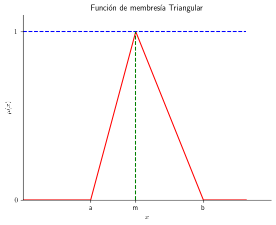

---
<!-- _class: compact -->

## Función trapezoidal

$$
    \mu(x) = \begin{cases}
      0, & \text{si } x < a \\
      \frac{x-a}{m-a}, & \text{si } a \leq x < m \\
      1, & \text{si } m \leq x < n \\
      \frac{b-x}{b-n}, & \text{si } n \leq x < b \\
      0, & \text{si } x \geq b \\
    \end{cases}
$$

Representa conceptos con una zona de pertenencia plena.

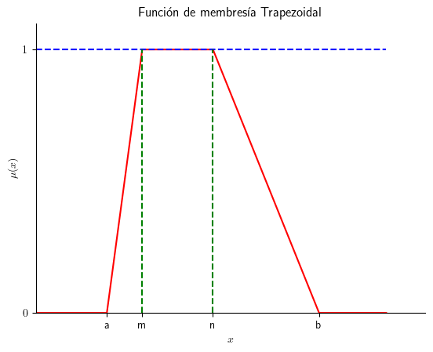

---
<!-- _class: compact -->

## Función gaussiana

$$
\mu(x) = e^{-k(x-m)^2},\qquad k > 0
$$

El parámetro $m$ ubica el centro del grupo. El parámetro $k$ controla qué tan rápido cae la pertenencia al alejarse del centro.

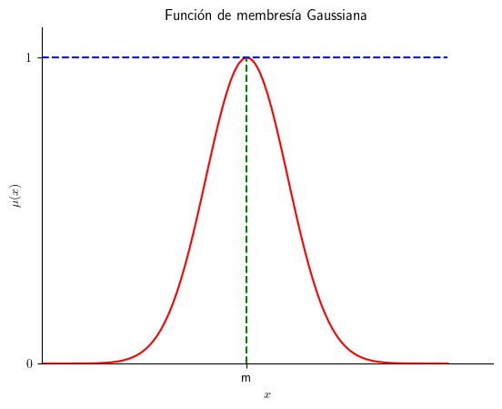

---
<!-- _class: compact -->

## Función-S

$$
    \mu(x) = \begin{cases}
      0, & \text{si } x < a \\
      2 \Bigl( \frac{x-a}{b-a} \Bigr)^2, & \text{si } a \leq x < m \\
      1 - 2 \Bigl( \frac{x-b}{b-a} \Bigr)^2, & \text{si } m \leq x < b \\
      1, & \text{si } x \geq b \\
    \end{cases}
$$

Con $m=(a+b)/2$, modela una transición suave desde no pertenencia hacia pertenencia plena.

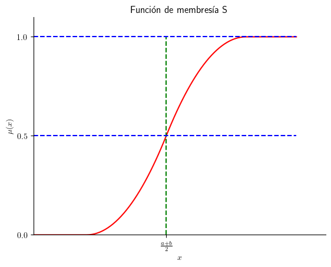

---

## Transformaciones sobre grupos difusos

Una transformación modifica una función ya definida. Permite expresar variantes lingüísticas de un grupo sin crear una forma desde cero.

Ejemplos:

- `alto` puede transformarse en `muy alto`.
- `caro` puede transformarse en `más o menos caro`.
- un conjunto subnormal puede normalizarse antes de compararlo.

La transformación cambia la interpretación operacional del grupo y también la activación de las reglas.

---
<!-- _class: compact -->

## Normalización

Permite convertir un conjunto difuso subnormal a un conjunto normal.

**Uso:** cuando la baja altura proviene de escala o calibración y se necesita comparar grupos con pertenencia plena.

**Ejemplo:** una etiqueta `caliente` alcanza máximo $0.8$ por construcción y se reescala antes de usarla en reglas.

$$
\text{NORM}(F,x) = \frac{\mu_{F}(x)}{h(F)}
$$

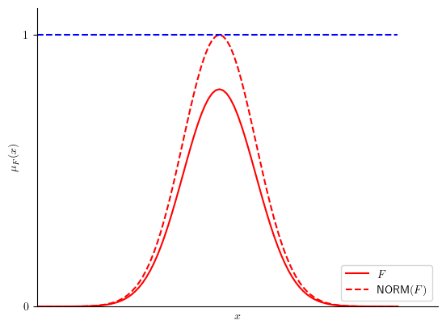

---
<!-- _class: compact -->

## Dilatación

Operación que permite dilatar o aplanar la función de membresía.

**Uso:** cuando se quiere una versión más amplia y permisiva de un grupo.

**Ejemplo:** `caro` puede transformarse en `más o menos caro`.

$$
\text{DIL}(F,x)=\bigl(\mu_{F}(x)\bigr)^{\frac{1}{2}}
$$

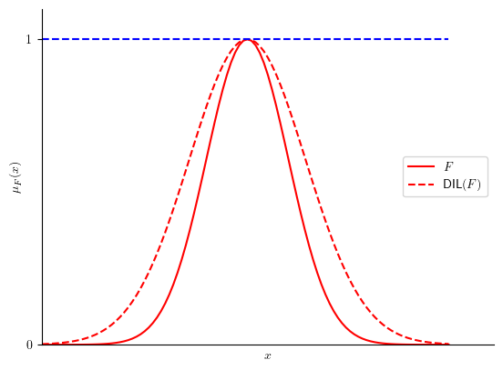

---
<!-- _class: compact -->

## Concentración

Operación que produce el efecto contrario a la dilatación.

**Uso:** cuando se quiere una versión más estricta o exigente de un grupo.

**Ejemplo:** `alto` puede transformarse en `muy alto`.

$$
\text{CON}(F,x)=\bigl(\mu_{F}(x)\bigr)^2
$$

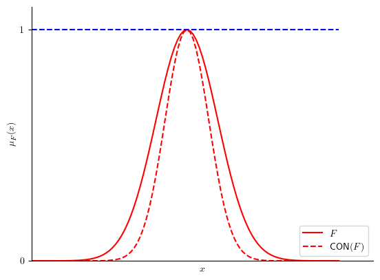

---
<!-- _class: compact -->

## Intensificación de contraste

Reduce los valores de membresía menores de $0.5$ y potencia valores mayores que $0.5$.

**Uso:** cuando se quiere separar mejor los casos débiles y fuertes.

**Ejemplo:** `riesgo alto` puede transformarse en `riesgo extremadamente alto`.

$$
    \text{INF}(F,x) = \begin{cases}
      2\bigl(\mu_{F}(x)\bigr)^2, & \text{si } 0 \leq \mu_{F}(x) \leq 0.5 \\
      1-2\bigl(1-\mu_{F}(x)\bigr)^2, & \text{en otro caso}
    \end{cases}
$$

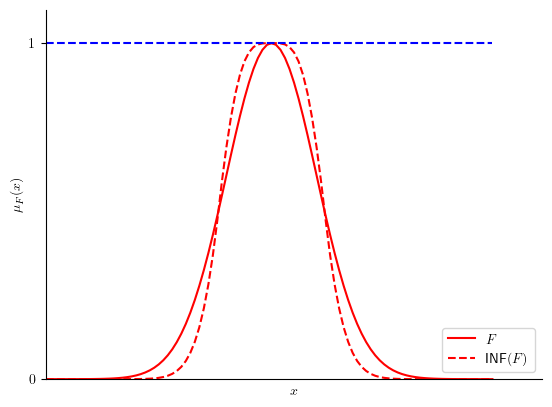

---
<!-- _class: compact -->

## Difusión

Produce el efecto contrario a la intensificación de contraste.

**Uso:** cuando se quiere suavizar una distinción demasiado marcada.

**Ejemplo:** `alto` puede transformarse en `aproximadamente alto`.

$$
    \text{FUZZ}(F,x) = \begin{cases}
      \bigl(\frac{\mu_{F}(x)}{2}\bigr)^{\frac{1}{2}}, & \text{si } 0 \leq \mu_{F}(x) \leq 0.5 \\
      1-\bigl(\frac{1-\mu_{F}(x)}{2}\bigr)^{\frac{1}{2}}, & \text{en otro caso}
    \end{cases}
$$

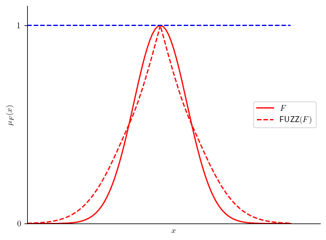

---

## De grupos a reglas

Hasta aquí se definieron grupos difusos y transformaciones:

- `alto`, `bajo`, `cerca`, `rápido`.
- `muy alto`, `más o menos caro`.

Pero una regla normalmente combina varios grupos:

> Si temperatura es alta **y** humedad es baja, entonces ventilación es media.

Para evaluar esa frase se necesita definir qué significan numéricamente **y**, **o** y **no** sobre grados de pertenencia.

Las operaciones básicas conectan las funciones de membresía con la activación de reglas difusas.

---

## Operaciones básicas

Con los operadores estándar de Zadeh:

| Lenguaje | Operación | Fórmula | Lectura |
|---|---|---|---|
| $A$ o $B$ | Unión | $\mu_{A\cup B}(x)=\max(\mu_A(x),\mu_B(x))$ | conserva el mayor grado |
| $A$ y $B$ | Intersección | $\mu_{A\cap B}(x)=\min(\mu_A(x),\mu_B(x))$ | limita por el antecedente más débil |
| no $A$ | Complemento | $\mu_{\bar A}(x)=1-\mu_A(x)$ | invierte el grado de pertenencia |

Cambiar el operador cambia la semántica de los conectores lingüísticos y, por tanto, la salida del sistema.

---

## Ejemplo: activación de una regla

Supongamos una regla:

> Si temperatura es alta **y** humedad es baja, entonces ventilación es media.

Para una medición concreta:

$$
\mu_{\text{alta}}(T)=0.7,\qquad \mu_{\text{baja}}(H)=0.4
$$

Con intersección estándar:

$$
\alpha=\min(0.7,0.4)=0.4
$$

La regla se activa con fuerza $0.4$ porque el antecedente conjunto queda limitado por la condición menos satisfecha.

Si el antecedente fuera **alta o baja**, el operador estándar sería:

$$
\max(0.7,0.4)=0.7
$$

---

## Variables lingüísticas

Una variable lingüística se describe mediante:

$$
V=(X,T(X),U,G,M)
$$

donde $X$ es el nombre, $T(X)$ sus términos, $U$ el universo, $G$ una gramática y $M$ la semántica que asigna funciones de pertenencia.

Esta tupla ordena el paso desde lenguaje natural hacia cálculo: primero se nombra la variable, luego se define qué valores puede tomar, qué palabras se usarán y cómo se evalúa cada palabra.

---
<!-- _class: compact -->

## Ejemplo de variable lingüística

Para temperatura ambiente:

$$
V_{\text{temp}}=(X,T(X),U,G,M)
$$

| Componente | En el ejemplo | Qué fija |
|---|---|---|
| $X$ | `temperatura` | magnitud que se observa |
| $U$ | $[10,40]\ ^\circ\mathrm{C}$ | dominio numérico válido |
| $T(X)$ | `baja`, `confortable`, `alta` | vocabulario base |
| $G$ | reglas como `muy` + término, `no` + término | términos compuestos admisibles |
| $M$ | $M(\text{alta})=\mu_{\text{alta}}(t)$ | función de pertenencia de cada término |

Así, $M$ permite evaluar una medición:

$$
\mu_{\text{alta}}(28)=0.8,\qquad
\mu_{\text{confortable}}(28)=0.4
$$

Sin $M$, las palabras solo nombran categorías. Con $M$, las palabras activan reglas con grados numéricos.

---

## De variables a dependencias

Una variable lingüística describe una magnitud aislada.

Un sistema de control necesita expresar dependencias entre magnitudes:

> Si temperatura es alta, entonces ventilación debe ser alta.

Esa frase no define solo dos conjuntos difusos, define qué pares entrada-salida son compatibles.

Las relaciones difusas formalizan el vínculo entre variables lingüísticas y preparan el razonamiento con reglas.

---

## Relaciones difusas

Una relación difusa $R$ sobre $X\times Y$ asigna un grado de compatibilidad a cada par:

$$
\mu_R:X\times Y\rightarrow[0,1]
$$

Ejemplo discreto entre términos:

| $R(\text{temperatura},\text{ventilaci\'on})$ | baja | media | alta |
|---|---:|---:|---:|
| baja | 1.0 | 0.3 | 0.0 |
| confortable | 0.4 | 1.0 | 0.4 |
| alta | 0.0 | 0.5 | 1.0 |

La entrada `temperatura alta` no obliga a una sola salida. Expresa mayor compatibilidad con `ventilación alta` y compatibilidad parcial con `media`.

---
## Composición max-min: observación

Sensor: $28\,^{\circ}\mathrm{C}$. Fuzzificación:

| Término de temperatura $x$ | baja | confortable | alta |
|---|---:|---:|---:|
| $\mu_{A'}(x)$ | 0.0 | 0.4 | 0.8 |

Una observación puede activar varias etiquetas: `alta` domina, pero `confortable` aún aporta.

---
<!-- _class: compact -->

## Composición max-min: una salida

Para `ventilación alta`, cada camino combina evidencia y relación:

| $x$ | $\mu_{A'}(x)$ | $\mu_R(x,\text{alta})$ | mínimo |
|---|---:|---:|---:|
| baja | 0.0 | 0.0 | 0.0 |
| confortable | 0.4 | 0.4 | 0.4 |
| alta | 0.8 | 1.0 | 0.8 |

$\min$ deja a cada camino con el respaldo de su condición más débil.

$\max(0.0,0.4,0.8)=0.8$ $\Rightarrow$ `ventilación alta`: **0.8**

---
<!-- _class: compact -->

## Composición max-min: otras salidas

Repetimos el cálculo para cada salida. Cada celda es $\min(\text{evidencia},\text{relaci\'on})$.

| Salida $y$ | desde baja | desde confortable | desde alta | máximo |
|---|---:|---:|---:|---:|
| baja | 0.0 | 0.4 | 0.0 | **0.4** |
| media | 0.0 | 0.4 | 0.5 | **0.5** |

El máximo de cada fila entrega el grado final. Para `alta` fue **0.8**.

---
<!-- _class: compact -->

## Composición max-min: resultado

Salida difusa:

| Ventilación $y$ | baja | media | alta |
|---|---:|---:|---:|
| Conclusión $\mu_{B'}(y)$ | 0.4 | 0.5 | 0.8 |

$$
\mu_{B'}(y)=\max_{x\in X}
\min\left(\mu_{A'}(x),\mu_R(x,y)\right)
$$

La salida conserva los tres grados, aún no selecciona una ventilación única.
Mínimo: respaldo de un camino. Máximo: mejor camino.

---
<!-- _class: compact -->

## Encadenar relaciones: temperatura, ventilación y consumo

Componemos $R(\text{temperatura},\text{ventilaci\'on})$ y $S(\text{ventilaci\'on},\text{consumo})$ para inferir temperatura-consumo sin definir esa relación directamente.

Para `temperatura alta` y `consumo alto`, cada fila es un camino por ventilación:

| Ventilación $y$ | $R(\text{alta},y)$ | $S(y,\text{alto})$ | Respaldo |
|---|---:|---:|---:|
| baja | 0.0 | 0.0 | 0.0 |
| media | 0.5 | 0.4 | 0.4 |
| alta | 1.0 | 1.0 | 1.0 |

El mejor camino da $\max(0.0,0.4,1.0)=1.0$.

$$
\mu_{R\circ S}(x,z)=\max_{y\in Y}
\min\left(\mu_R(x,y),\mu_S(y,z)\right)
$$

$y$ representa la ventilación que conecta ambas relaciones.
El mínimo evalúa cada camino y el máximo conserva el más fuerte.

---

## Funciones con entradas difusas

Las relaciones difusas expresan reglas entre variables. Otras etapas del sistema se describen mediante una función numérica:

$$
y=f(x)
$$

Ejemplo:

- Convertir temperatura: $F=1.8C+32$.

Si $C$ es una temperatura difusa, cada valor de $C$ se transforma en un valor de $F$. La salida también debe ser difusa: necesitamos asignar un grado de pertenencia a cada $F$.

---

## Principio de extensión

El principio de extensión lleva los grados de una entrada difusa $A$ a la salida de una función $y=f(x)$:

$$
\mu_B(y)=\sup_{x:f(x)=y}\mu_A(x)
$$

Cada valor de salida conserva el mayor grado de los valores de entrada que pueden producirlo.

Es útil en conversiones y cálculos numéricos. Para esta clase queda como referencia. El sistema Mamdani que construiremos se basa en reglas, agregación y desfusificación.

---

## Razonamiento difuso

En este curso construiremos un sistema de inferencia tipo **Mamdani**. Cada regla tiene un consecuente difuso: al activarse, aporta una recomendación gradual que luego se combina con las demás y se desfusifica.

El [modus ponens](https://en.wikipedia.org/wiki/Modus_ponens) generalizado combina un hecho parcial con una regla:

- Regla: si $x$ es $A$, entonces $y$ es $B$.
- Hecho: $x$ es $A'$.
- Conclusión: $y$ es $B'$.

La conclusión se obtiene componiendo $A'$ con la relación difusa que representa la regla. Su fuerza depende de la compatibilidad entre $A'$ y $A$.

La inferencia no consiste en buscar una regla idéntica: propaga grados de compatibilidad entre antecedentes y consecuentes.

---

## Reglas difusas

Una regla Mamdani adopta la forma:

> Si temperatura es alta **y** humedad es alta, entonces ventilación es intensa.

Para entradas $x_0,y_0$, la fuerza de activación usa el operador `y` mínimo:

$$
\alpha_i=\min\left(\mu_{A_i}(x_0),\mu_{B_i}(y_0)\right)
$$

En esta presentación se usa implicación mínimo. El consecuente se recorta a la altura $\alpha_i$.

Cada regla aporta un conjunto difuso de salida. Varias reglas pueden activarse al mismo tiempo y aportar regiones distintas.

---

## Base de reglas difusas

Una regla aislada representa conocimiento local. La base completa debe cubrir la región operacional.

- Si la temperatura es baja, entonces la ventilación es baja.
- Si la temperatura es confortable y la humedad es baja, entonces la ventilación es baja.
- Si la temperatura es confortable y la humedad es alta, entonces la ventilación es media.
- Si la temperatura es alta y la humedad es baja, entonces la ventilación es media.
- Si la temperatura es alta y la humedad es alta, entonces la ventilación es alta.

Reglas contradictorias son admisibles, pero su interacción debe evaluarse sobre todo el dominio.

---

<!-- _class: compact -->

## Sistema de inferencia difuso

Es un sistema que transforma entradas numéricas en una salida numérica usando **variables lingüísticas y reglas difusas**.

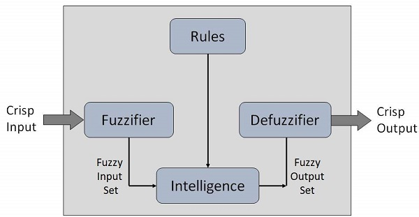

La entrada numérica se transforma en un conjunto difuso. Las reglas producen una salida difusa y la desfusificación la convierte en una acción numérica.

---

## Flujo del sistema Mamdani

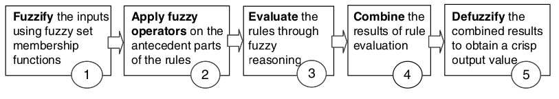

1. Fusificación de entradas numéricas.
2. Evaluación de antecedentes.
3. Implicación de cada regla.
4. Agregación de consecuentes.
5. Desfusificación de la salida.

La **fusificación** transforma mediciones precisas en grados de pertenencia. La **desfusificación** obtiene una acción numérica desde el conjunto de salida agregado.

---
<!-- _class: compact -->

## 1. Fusificación: activar términos de entrada

Tomemos una lectura de temperatura de $28\,^\circ\mathrm{C}$ y una humedad de $70\%$, con $\mu_{\text{alta}}=0.6$ y $\mu_{\text{baja}}=0$.

| Entrada medida | Términos activados |
|---|---|
| Temperatura $=28\,^\circ\mathrm{C}$ | $\mu_{\text{alta}}=0.8$, $\mu_{\text{confortable}}=0.4$ |
| Humedad $=70\%$ | $\mu_{\text{alta}}=0.6$ |

Una entrada no elige una sola etiqueta. Todos sus grados pasan a la base de reglas.

---
<!-- _class: compact -->

## 2 y 3. Activación e implicación

Con las reglas de la base y el operador `y` mínimo:

$$
\begin{aligned}
R_1&:\ \text{temperatura alta y humedad alta} \rightarrow \text{ventilación alta} \\
R_2&:\ \text{temperatura confortable y humedad alta} \rightarrow \text{ventilación media}
\end{aligned}
$$

$$
\alpha_1=\min(0.8,0.6)=0.6,\qquad
\alpha_2=\min(0.4,0.6)=0.4
$$

La implicación recorta `ventilación alta` a $0.6$ y `ventilación media` a $0.4$.

---
<!-- _class: compact -->

## 4. Agregación

Del ejemplo anterior se combinan dos consecuentes recortados:

$$
\mu_{\text{salida}}(z)=
\max\left(
\min(0.6,\mu_{\text{alta}}(z)),
\min(0.4,\mu_{\text{media}}(z))
\right)
$$

En cada valor de $z$, el máximo conserva la contribución más fuerte.

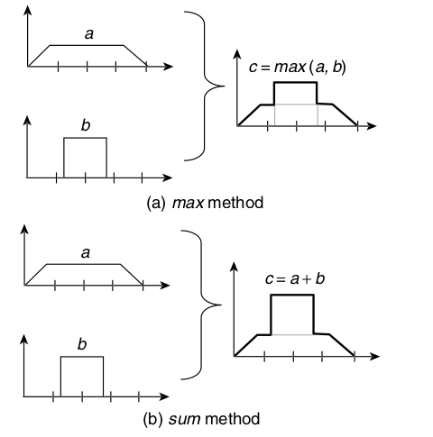

La salida agregada reúne las recomendaciones de todas las reglas antes de elegir una acción.

---
<!-- _class: compact -->

## 5. Desfusificación por centroide

El centroide convierte el conjunto de salida en un valor del universo de ventilación. En el notebook, ese universo se discretiza:

$$
z^*\approx\frac{\sum_j z_j\mu_{salida}(z_j)}{\sum_j\mu_{salida}(z_j)}
$$

La suma es una discretización del cálculo del centroide continuo.

Si $z$ representa velocidad entre $0$ y $100\%$, por ejemplo, un centroide $z^*=65$ ordena operar el ventilador al $65\%$.

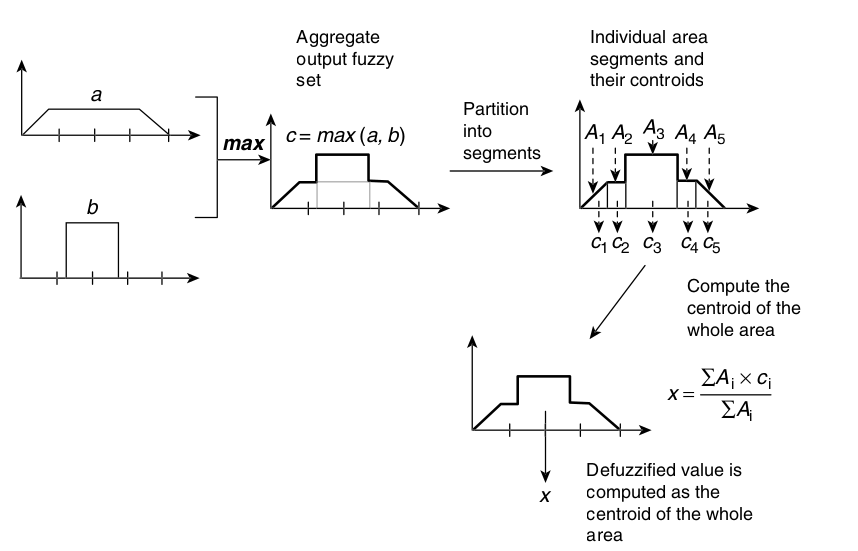

Si el denominador es cero, ninguna regla produjo una salida y el sistema debe definir explícitamente cómo responder.

---

## Ejemplo: propina en un restaurante

Una persona califica la comida y la atención entre $1$ y $7$. El sistema recomienda una propina entre $0$ y $15\%$.

- `calidad`: pésima, malita, piola, de pana, basadísima.
- `atención`: amarga, pesada, noesni, tela, joya.
- `propina`: nada, poca, normal, extra.

Si la calidad es pésima y la atención es amarga, la propina es nada. Si la calidad es basadísima y la atención es joya, la propina es extra.

---

## Ejemplo ejecutable: propina

El notebook [`notebook/02_SciKit_Fuzzy.ipynb`](notebook/02_SciKit_Fuzzy.ipynb) implementa este sistema Mamdani con `calidad`, `atención` y `propina`:

- `numpy` para los universos discretos.
- `scikit-fuzzy` para membresías, reglas e inferencia.
- Un caso con calificaciones numéricas que activa reglas y entrega una propina desfusificada.

Al ejecutarlo, identifique:

1. Los grados de pertenencia de cada calificación.
2. Las reglas que se activan.
3. El conjunto de salida agregado.
4. La propina numérica obtenida por centroide.

---

## Qué se debe validar

- Rango y unidades de cada universo.
- Cobertura de las funciones de pertenencia.
- Consistencia de la base de reglas.
- Monotonicidad donde el dominio la exija.
- Comportamiento en fronteras y entradas no nominales.
- Sensibilidad al método de desfusificación.

La interpretabilidad no es automática: un sistema difuso es explicable solo si sus variables, membresías y reglas tienen una semántica defendible.

---

## Lectura complementaria

Los artículos en `../../Material/` muestran sistemas difusos para lavadora y aire acondicionado.

Al revisarlos, identifique:

1. Variables medibles y términos lingüísticos.
2. Origen de las membresías y reglas.
3. Evidencia usada para evaluar el controlador.

---

## Síntesis

- Variables lingüísticas y membresías representan conceptos graduales.
- Las reglas y su base conectan conocimiento lingüístico con una salida.
- Un sistema Mamdani fusifica, evalúa reglas, agrega y desfusifica.
- El centroide convierte la salida agregada en una acción numérica.
- La cobertura y la superficie completa deben validarse.

La próxima unidad cambia reglas lingüísticas por poblaciones de candidatos. Pasamos de inferencia difusa a búsqueda evolutiva.

---

## Referencias y material complementario

- Material original de IPD434: `02_SistemasDifusos.ipynb`. El notebook ejecutable de esta clase es `notebook/02_SciKit_Fuzzy.ipynb`.
- L. A. Zadeh, “Fuzzy Sets”, *Information and Control*, 1965.
- T. J. Ross, *Fuzzy Logic with Engineering Applications*, 3.ª ed., Wiley, 2010.
- [Modus ponens](https://en.wikipedia.org/wiki/Modus_ponens), Wikipedia.
- N. Wulandari y A. G. Abdullah, “Design and Simulation of Washing Machine using Fuzzy Logic Controller”, 2018. Disponible en `../../Material/`.
- S. M. Sobhy y W. M. Khedr, “Developing of Fuzzy Logic Controller for Air Condition System”, 2015. Disponible en `../../Material/`.
