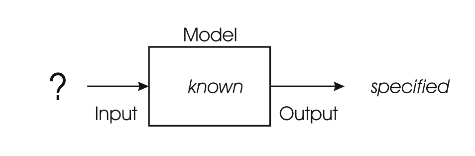
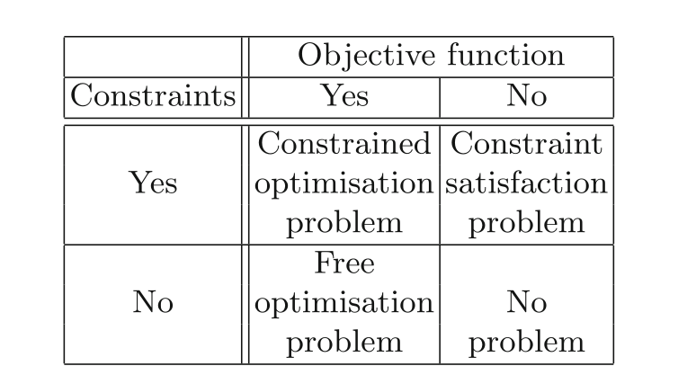
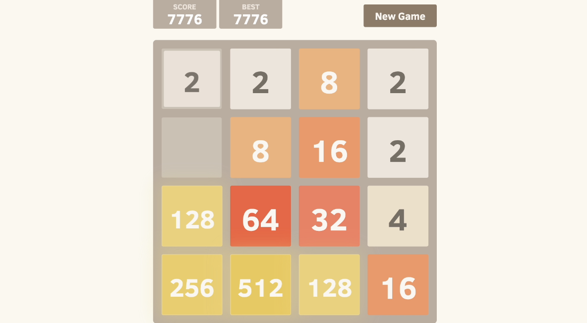
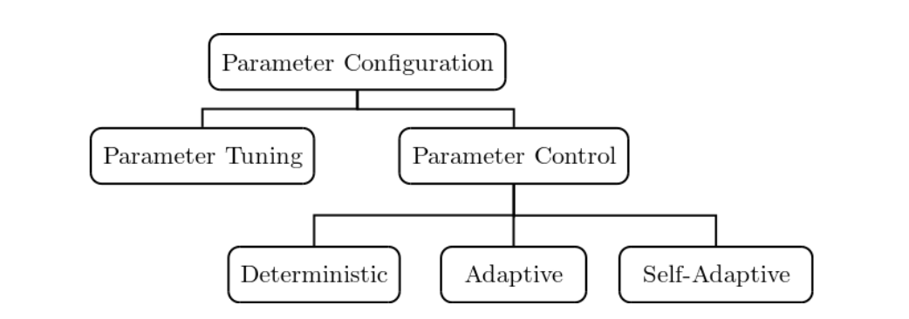
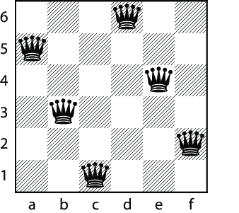
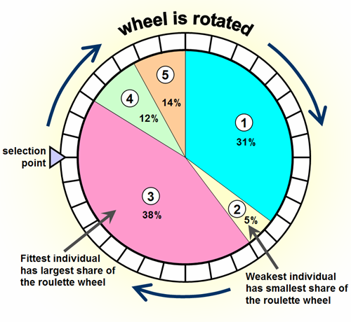
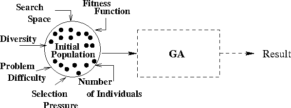
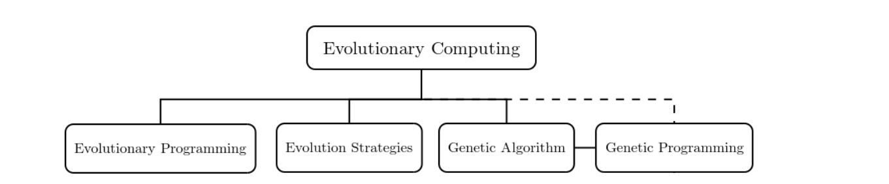

<!-- _class: lead -->

# IPD434 · Seminario de Soft Computing
## Computación evolutiva
### De la formulación de un problema a la evolución de soluciones

Dr. Patricio Olivares Roncagliolo 
Material basado y ampliado a partir del material desarrollado por el **Prof. Nicolás Gálvez Ramírez**.

---

## El punto de partida: elegir una configuración

Un horario académico contiene muchas formas de asignar cursos, docentes, salas y bloques. Ninguna regla simple entrega de inmediato la mejor combinación.

Problema de búsqueda:

> ¿Cómo encontrar una buena configuración cuando podemos comprobar su calidad, pero no sabemos construir directamente la mejor?

La computación evolutiva responde explorando y transformando una **población** de configuraciones candidatas.

---

## Calidad, factibilidad y espacio de búsqueda

En el horario se distinguen tres elementos:

| Elemento | Pregunta | Ejemplo |
|---|---|---|
| **Candidatos** | ¿Qué configuraciones se pueden proponer? | Asignaciones de cursos, salas y bloques |
| **Calidad** | ¿Qué preferimos entre dos candidatos? | Menos topes, mejor uso de salas, más preferencias atendidas |
| **Condiciones obligatorias** | ¿Qué no se puede violar? | Capacidad, disponibilidad y compatibilidad |

Cuando la incógnita es una configuración y podemos evaluarla, el problema se transforma en uno de <strong>búsqueda y optimización</strong>.

---

## Ruta conceptual

### Formulación → espacio de búsqueda → metaheurística → población → evidencia

La formulación define la decisión y su evaluación. Luego se selecciona una estrategia para recorrer el espacio de posibilidades.

Cada etapa condiciona la siguiente: una mala formulación o representación no se arregla agregando más generaciones al algoritmo.

---

## ¿Qué parte del problema es la incógnita?

Un mismo sistema puede describirse mediante **entrada**, **modelo** y **salida**. El tipo de problema depende de cuál de esas piezas es la incógnita.

En el horario, el modelo y la evaluación están definidos. La <strong>entrada</strong> es la incógnita: una configuración de decisiones. Esa es la situación de optimización.

---

## Tres preguntas distintas sobre una misma caja negra

| Problema | Lo que conocemos | Lo que buscamos | Ejemplo |
|---|---|---|---|
| **Simulación** | Una entrada y un modelo | La salida que produce el modelo | Pronóstico meteorológico |
| **Modelado** | Entradas y salidas observadas | Un modelo que explique y generalice | Clasificador de imágenes |
| **Optimización** | Un modelo y cómo evaluar su salida | La entrada que da el mejor resultado | Planificación académica |

La distinción no clasifica algoritmos. Aclara qué objeto estamos intentando obtener. En optimización, ese objeto es una **solución candidata**.

---

## Optimización: buscar la mejor entrada posible

En optimización conocemos el modelo y la forma de evaluar su salida. La incógnita es la **entrada** o configuración que produce el mejor resultado.

En la planificación académica:

- **Modelo:** asignación de cursos a profesores, salas y bloques.
- **Entrada buscada:** una configuración particular de esas asignaciones.
- **Salida evaluada:** cantidad de topes, incumplimientos o costos.
- **Objetivo:** encontrar la configuración con el menor costo posible.

---

## Optimización como formulación general

Muchos problemas de modelado también se entrenan reescribiéndolos como optimización:

$$
\theta^*=\arg\min_{\theta}\ \mathcal{L}(\text{datos},\,\text{modelo}_{\theta})
$$

- En una red neuronal, $\theta$ son pesos y $\mathcal{L}$ puede ser el error de predicción.
- En un sistema difuso, $\theta$ puede representar parámetros de membresía o reglas.
- En optimización de configuraciones, $\theta$ es una solución candidata, como un horario, una ruta o una configuración.

La computación evolutiva es especialmente útil cuando la función se puede evaluar, pero no es fácil derivarla, es discontinua, ruidosa o proviene de una simulación.

---

## Cuando las decisiones se combinan, el espacio crece rápido

La **optimización combinatoria** busca el mejor objeto dentro de un conjunto finito de objetos.

El conjunto puede ser finito y aun así ser imposible de recorrer exhaustivamente. Por ejemplo, ordenar $n$ actividades tiene $n!$ posibilidades.

$$
x^*=\arg\min_{x\in\Omega} f(x)
$$

- $\Omega$: soluciones admisibles o espacio de búsqueda.
- $x$: una configuración candidata.
- $f(x)$: función objetivo o medida de calidad.

La metaheurística administra un presupuesto limitado de evaluaciones de $f$.

---

## Formular la búsqueda: generar, evaluar y respetar condiciones

| Tarea | Pregunta que se responde | Ejemplo: horario académico |
|---|---|---|
| **Encontrar** | ¿Qué candidatos puedo construir? | Asignaciones de cursos, salas y bloques |
| **Evaluar** | ¿Qué tan buena es una candidatura? | Topes, capacidad, preferencias, uso de salas |
| **Aceptar** | ¿Es factible y debe conservarse? | Respeta restricciones y compite con otros |

Una formulación explícita del espacio, la evaluación y las restricciones hace que el diseño sea discutible y reproducible.

---

## La formulación fija el significado de solución

La formulación define:

- el espacio de candidatos
- el criterio de calidad
- las restricciones de factibilidad

La misma instancia puede ser FOP, CSP o CSOP según cómo se combinen estos elementos.

---

## Objetivo y restricciones definen tres formulaciones

La diferencia entre estos nombres está en qué se considera una solución.

| Sigla | Nombre completo | Qué se busca |
|---|---|---|
| **FOP** | Problema de Optimización Libre, *Free Optimisation Problem* | Optimizar una función sin restricciones explícitas |
| **CSP** | Problema de Satisfacción de Restricciones, *Constraint Satisfaction Problem* | Encontrar una solución que cumpla todas las restricciones |
| **CSOP / COP** | Problema de Optimización y Satisfacción de Restricciones, *Constraint Satisfaction and Optimisation Problem*. También se llama Problema de Optimización Restringido, *Constrained Optimisation Problem* | Optimizar entre las soluciones que cumplen las restricciones |

---

## Ejemplo conductor: N reinas

> Ubicar $n$ reinas en un tablero $n\times n$ sin que dos se ataquen.

Dos reinas entran en conflicto si comparten fila, columna o diagonal. El ejemplo permite aplicar las tres formulaciones y luego introducir la representación y los algoritmos.

---

## La misma instancia con tres formulaciones

| Formulación | Criterio de solución | Resultado aceptado |
|---|---|---|
| **FOP** | Maximizar una función de evaluación | Tablero con el mejor valor de evaluación |
| **CSP** | Satisfacer un predicado de factibilidad | Tablero sin reinas en jaque |
| **CSOP** | Satisfacer restricciones y optimizar una evaluación | Mejor tablero entre los que cumplen las restricciones |

Las tres formulaciones usan un tablero $n\times n$ con $n$ reinas. Cambia la forma de expresar la condición de solución.

---

## N reinas como problema de optimización libre

**Representación:** tablero de ajedrez de tamaño $n\times n$ con $n$ reinas.

**Espacio de búsqueda:**

$$
S=\{s\mid s\text{ es una configuración del tablero con }n\text{ reinas}\}
$$

**Función de evaluación:** $f(s)$ es la cantidad de reinas que no están en jaque.

$$
S^*=\{s\in S\mid f(s)=n\}
$$

No hay restricciones explícitas. Los tableros con reinas en conflicto reciben una evaluación menor.

---

## N reinas como satisfacción de restricciones

**Representación y espacio:** el mismo tablero y el mismo conjunto $S$ de configuraciones con $n$ reinas.

**Predicado de factibilidad:**

$$
\operatorname{enJaque}(s)=
\begin{cases}
\text{verdadero}, & \text{si dos reinas se atacan}\\
\text{falso}, & \text{en otro caso}
\end{cases}
$$

**Soluciones:**

$$
S^*=\{s\in S\mid \operatorname{enJaque}(s)=\text{falso}\}
$$

No se ordenan las soluciones factibles. Cualquier tablero sin ataques resuelve el CSP.

---

## N reinas como optimización con restricciones

**Representación y espacio:** el mismo tablero y el mismo conjunto $S$ de configuraciones con $n$ reinas.

**Restricciones:** $\operatorname{mismaFila}(s)$ y $\operatorname{mismaColumna}(s)$ indican que existen dos reinas en una fila o columna común.

**Función de evaluación:** $D(s)$ cuenta los ataques por diagonal.

$$
\begin{aligned}
\min_{s\in S}\ & D(s)\\
\text{sujeto a}\quad & \operatorname{mismaFila}(s)=\text{falso}\\
& \operatorname{mismaColumna}(s)=\text{falso}
\end{aligned}
$$

Las restricciones conservan una reina por fila y columna. La evaluación distingue los tableros factibles según sus diagonales.

---

## La representación convierte la formulación en candidatos

La formulación define qué solución es válida. La representación define cómo codificarla.

En N reinas, un vector reduce el espacio del tablero. Las versiones siguientes difieren en cómo manejan la restricción de filas.

---

## Representación versión 1: vector con restricción explícita

Cada posición del vector representa una columna. Su valor indica la fila de la reina en esa columna:

$$
x=(x_1,\ldots,x_n),\qquad x_i\in\{1,\ldots,n\}
$$

La posición asegura una reina por columna. El espacio incluye vectores con filas repetidas:

$$
S_1=\{1,\ldots,n\}^n
$$

El predicado $\operatorname{todosDistintos}(x)$ es verdadero cuando no hay dos valores iguales. La búsqueda mantiene esa condición como una restricción explícita:

$$
\min_{x\in S_1}D(x)\qquad\text{sujeto a}\qquad \operatorname{todosDistintos}(x)=\text{verdadero}
$$

---

## Representación versión 2: espacio de permutaciones

La codificación del vector se conserva, pero el espacio de búsqueda excluye desde el inicio las filas repetidas:

$$
S_2=\{x\in\{1,\ldots,n\}^n\mid \operatorname{todosDistintos}(x)\}
=\operatorname{Perm}(\{1,\ldots,n\})
$$

La condición de fila deja de ser un predicado externo. Cada vector de $S_2$ contiene una reina por fila y columna por construcción.

$$
x^*\in\arg\min_{x\in S_2}D(x)
$$

Para seis reinas, el vector x = [5, 3, 1, 6, 4, 2] es una permutación. Esto garantiza una reina por fila y columna. Solo falta evaluar las diagonales.

---

## Evaluar los ataques diagonales

En el vector $x$, $x_i$ es la fila de la reina situada en la columna $i$. Para dos columnas $i$ y $j$, hay ataque diagonal cuando la diferencia de filas coincide con la diferencia de columnas:

$$
C(x)=\sum_{i<j}\mathbf{1}\{|x_i-x_j|=|i-j|\}
$$

La función indicadora vale $1$ cuando el par comparte diagonal y $0$ en caso contrario. Por tanto, $C(x)$ cuenta todos los pares en conflicto.

La permutación elimina los conflictos de fila y columna por construcción. $C(x)=0$ indica una solución válida de N reinas.

---

## Paradigmas de búsqueda

### Hard Computing y Soft Computing en optimización combinatoria

Existen distintos paradigmas para afrontar la búsqueda de soluciones en el espacio de búsqueda.

---

## Aproximación sistemática y búsqueda local

### Aproximación sistemática

- **Completitud.**
- Búsqueda sistemática sobre el espacio, garantizando:
  - una solución óptima, o
  - que no existe solución.
- Es computacionalmente costosa.

---

## Aproximación sistemática y búsqueda local

### Búsqueda local

- **Incompletitud.**
- Búsqueda parcial sobre distintos subespacios.
- No puede garantizar:
  - una solución óptima,
  - una solución factible, ni
  - que no existe solución.
- Es computacionalmente rápida.

---

## Búsqueda constructiva y perturbativa

### Búsqueda constructiva

- Encuentra la solución desde un inicio vacío.
- Generalmente produce soluciones incompletas durante el proceso.

### Búsqueda perturbativa

- Encuentra una solución modificando una existente.
- Generalmente busca mejoras sobre un candidato de baja calidad.

---

## Heurísticas

- Son **reglas prácticas o criterios** para guiar la búsqueda de soluciones.
- Se apoyan en el **conocimiento del problema** para tomar decisiones rápidas.
- Generalmente son **miopes**: evalúan solo la ganancia inmediata sin considerar el impacto global.
- **Ejemplo:** un **algoritmo greedy** construye una solución paso a paso, eligiendo siempre la opción localmente mejor según la heurística.

---

## Ejemplo: 2048

- ¿Qué heurística usaría para terminar el juego?

---

## Metaheurísticas

> Proceso automático para buscar una buena solución, ya sea construyéndola o reparándola, respecto a un conjunto de candidatos finito pero intratable por su tamaño.

- Proporcionan **estrategias globales** para acercarse rápidamente a un óptimo, aunque no siempre garantizan el mejor.
- No son reglas específicas del problema, sino un **marco genérico** aplicable a distintos contextos.
- Suelen combinar **búsqueda local** para mejorar soluciones en un área reducida con **búsqueda perturbativa** para explorar nuevas regiones.

---

## Conceptos clave

### Búsqueda local

> Encontrar una solución óptima en una porción reducida del espacio de búsqueda.

### Búsqueda perturbativa

> Modificar un candidato a solución conocido para obtener uno nuevo.

---

## Conceptos clave

### Explotación o intensificación

> Concentrar la búsqueda en la porción del espacio de búsqueda visitada.

### Exploración o diversificación

> Ampliar la búsqueda a un fragmento más grande del espacio de búsqueda.

---

## Conceptos clave: Explotación vs exploración

Ambas son relevantes. Debe existir un equilibrio que varía entre problemas.

- Si nos concentramos en explotar, podemos estancarnos prematuramente en un óptimo local.
- Si nos concentramos en explorar, la búsqueda puede no converger a una solución.

---

## ¿Cómo buscan las metaheurísticas clásicas?

### Candidato

> Solución construida u obtenida de otro proceso que será evaluada y modificada en pos de mejoras.

### Movimiento: perturbación

> Cambio que se puede aplicar al candidato para generar nuevas soluciones.

### Vecindario

> Conjunto de nuevas soluciones generadas desde el candidato al aplicar el movimiento en las distintas opciones posibles.

---

## Criterio de selección

> Directriz para seleccionar al siguiente candidato en la búsqueda.

- **Alguna mejora:** primer vecino que mejora la función de evaluación.
- **Mejor mejora:** vecino que maximiza la mejora de la función de evaluación.

---

## Criterios de reinicio y término

### Criterios de reinicio

> Criterios para evitar el estancamiento en un óptimo local.

- Reiniciar luego de cierta cantidad de iteraciones.
- Reiniciar desde un nuevo candidato inicial.

### Criterio de término

> Criterio de término de la metaheurística.

- No encontrar un mejor vecino.
- Cumplir un número de iteraciones.
- Alcanzar un tiempo máximo.

Estas decisiones concretan el equilibrio entre explotación y exploración.

---

## Metaheurísticas clásicas

Con estos mecanismos ya podemos comparar metaheurísticas clásicas. Hill Climbing es una búsqueda local de referencia. Las demás incorporan diversificación o aceptación menos codiciosa.

| Método | Mecanismo de búsqueda |
|---|---|
| [Hill Climbing](https://en.wikipedia.org/wiki/Hill_climbing) | Acepta mejoras del vecindario y puede quedar en un óptimo local. |
| [Iterated Local Search](https://en.wikipedia.org/wiki/Iterated_local_search) | Perturba la solución y reinicia la búsqueda local. |
| [Tabu Search](https://en.wikipedia.org/wiki/Tabu_search) | Usa memoria para evitar movimientos recientes. |
| [Simulated Annealing](https://en.wikipedia.org/wiki/Simulated_annealing) | Acepta ocasionalmente soluciones peores para escapar. |
| [GRASP](https://en.wikipedia.org/wiki/Greedy_randomized_adaptive_search_procedure) | Alterna construcción voraz aleatorizada y búsqueda local. |

Las técnicas difieren en cómo combinan intensificación, diversificación y aceptación.

---

## ¿Y el multiobjetivo?

En muchos problemas no buscamos optimizar un solo criterio, sino varios al mismo tiempo, que incluso pueden entrar en conflicto. Por ejemplo, minimizar costos y maximizar calidad.

- **Evaluación con pesos:** combina los objetivos en una sola función ponderada.
- **Bi-objetivo o bi-criterio:** trata los objetivos por separado y busca un compromiso.
- **Frente de Pareto:** conjunto de soluciones donde no se puede mejorar un objetivo sin empeorar otro.

---

## ¿Y el multiobjetivo?

La figura muestra este frente:

- Los puntos azules (*bruteforce*) representan las soluciones evaluadas.
- Los puntos rojos son las soluciones no dominadas.
- El punto verde es una solución encontrada sobre el frente.

---

## Configuración de parámetros en metaheurísticas

Las metaheurísticas requieren parámetros, como número de iteraciones, tamaño del vecindario o probabilidad de aceptar soluciones peores. La forma de configurarlos influye directamente en los resultados.

- **Parameter Tuning:** fija los valores antes de ejecutar, mediante pruebas o recomendaciones.
- **Parameter Control:** modifica los valores durante la ejecución.
  - **Deterministic:** sigue una regla fija.
  - **Adaptive:** cambia según el desempeño observado.
  - **Self-Adaptive:** evoluciona junto con las soluciones.

---

## Configuración de parámetros en metaheurísticas

---

## ¿Podemos buscar con varios candidatos simultáneamente?

- **Sí.** En lugar de avanzar con una sola solución, podemos trabajar con un conjunto de candidatos en paralelo.
- Esto permite cubrir mejor distintas zonas del espacio de búsqueda y reducir el riesgo de quedar atrapado en un óptimo local.
- Para ello utilizaremos **poblaciones**.

---

## Computación evolutiva

> Metaheurísticas bioinspiradas basadas en los principios de la teoría de la evolución y la selección natural de Charles Darwin.

- Tuvieron gran auge desde los años 90 y fueron creadas en los años 70.
- Se conocen como **algoritmos evolutivos** (*EA, Evolutionary Algorithms*).
- Amplían la búsqueda a varios candidatos simultáneamente.
- Perturban los candidatos con operadores evolutivos clásicos.

---

## Algoritmos evolutivos: framework

---

## Representación en algoritmos genéticos

En los algoritmos genéticos, cada **solución real** debe traducirse a una forma que el algoritmo pueda manipular. Para eso distinguimos dos niveles:

- **Fenotipo, mundo real:** la solución tal como existe en el problema original, por ejemplo un tablero, un horario o una ruta.
- **Genotipo, mundo evolutivo:** la forma codificada de la solución, utilizada por el algoritmo.
- **Representación:** mapeo entre ambos mundos.
  - **Codificación:** del mundo real al evolutivo.
  - **Decodificación:** del mundo evolutivo al real.

---

## Ejemplo activo: problema de las 6 reinas

- **Genotipo:** vector de representación $[5,3,1,6,4,2]$.
- **Fenotipo:** configuración correspondiente del tablero.

---

## Componentes de una solución

### Gen

- Es cada elemento básico que forma la representación de un individuo.
- Corresponde a una variable o posición dentro de la solución.

### Alelo

- Es el valor concreto que toma un gen en un individuo.
- Representa una instanciación específica de esa variable.

---

## Ejemplo activo: problema de las 6 reinas

Para $X=[5,3,1,6,4,2]$:

- **Individuo, genotipo:** vector de representación $X$.
- **Gen $X[0]$:** posición asociada a la primera columna.
- **Alelo $X[0]$:** fila en la que está ubicada la reina de la primera columna.

---

## Función de fitness

La **función de fitness** es la función de evaluación utilizada en los algoritmos genéticos.

- Mide la calidad de cada genotipo y su capacidad de sobrevivir en el proceso evolutivo.
- Refleja qué tan bien adaptado está un individuo al problema.
- Normalmente decodifica el genotipo al fenotipo y mide su desempeño en el mundo real.

---

## Población

Una población es el conjunto de **candidatos a solución** que el algoritmo manipula en cada generación.

- Se habla de **multiconjunto** porque pueden existir individuos repetidos.
- Los individuos estáticos no cambian durante la ejecución.
- Las poblaciones dinámicas evolucionan aplicando selección, mutación o recombinación.
- El tamaño de la población $pop$ suele mantenerse constante.

Es la base sobre la que actúan los operadores evolutivos que impulsan la búsqueda.

---

## Diversidad

La diversidad indica **qué tan distintas** son las soluciones dentro de la población. Es clave para mantener un equilibrio entre **exploración** y **explotación**.

**Formas de medirla:**

- Variación en los valores de la función de fitness.
- Cantidad de fenotipos diferentes, es decir, soluciones distintas en el mundo real.
- Cantidad de genotipos diferentes, es decir, cromosomas distintos.
- Métricas estadísticas como la entropía.

---

## Operadores

Son los mecanismos principales que permiten que una población evolucione de una generación a otra. Se dividen en tres categorías:

- **Operadores de selección de evolución:** determinan qué individuos se convierten en padres.
- **Operadores de evolución:** mutación y recombinación producen nuevos candidatos.
- **Operadores de selección de supervivencia:** deciden qué individuos permanecen en la población siguiente.

---

## Selección de padres

Los operadores de selección de padres filtran miembros de la población según su calidad, permitiéndoles ser padres de la próxima generación.

- Buscan favorecer buenas características y mejorar globalmente la función de fitness.
- No se debe dejar sin posibilidades a un individuo de baja calidad.
- Pueden ser probabilísticos: aleatoria, ranking, torneos o ruletas.

---

## Ejemplo: Roulette-Wheel Selection

La probabilidad de selección es proporcional a la aptitud asignada a cada individuo.

---

## Mutación

> Operadores que permiten modificar la población.

- Es una **perturbación** aplicada a un **padre** para generar un **hijo**.
  - Es una operación unaria, sobre un solo individuo.
- La perturbación se aplica de forma **aleatoria**.
  - Las mutaciones son **estocásticas**.
  - Pueden no ocurrir.
- Permite conectar distintos sectores del espacio de búsqueda.

---

## Mutaciones clásicas

Perturbaciones clásicas aplicadas a los individuos.

---

## Recombinación

La recombinación mezcla la información genética de dos padres en uno o dos hijos.

- Es un procedimiento estocástico y aleatorizado.
- Tiene una probabilidad de recombinación, por lo que puede no ocurrir.
- También depende del punto de cruzamiento.

---

## Recombinación: N reinas

Ejemplo de recombinación para N reinas.

---

## Mutación y recombinación

Cuando se combinan, siguen el camino evolutivo:

1. Recombinación → descendencia.
2. Descendencia → mutaciones.

---

## Operadores de selección de supervivencia

> Operadores que emulan la adaptabilidad al ambiente de la generación actual y/o su descendencia.

---

## Elitismo

El elitismo permite mantener en la generación al o a los mejores individuos de la generación anterior respecto a su adaptación (*fitness*).

Variantes:

- Mantener al mejor generador de hijos.
- Mantener al mejor fenotipo.
- Mantener al mejor genotipo.

---

## Ranking de fitness

Selecciona $n\leq size(pop)$ individuos ordenados según su valor de fitness.

- En el ranking participan padres e hijos.
- El tamaño de $n$ depende de otros criterios de supervivencia.

---

## Edad de los individuos

La eliminación de individuos puede depender de su edad.

- Simula la condición finita de permanencia de un individuo de una especie.
- Se define un parámetro de **máxima cantidad de generaciones** para los individuos.

---

## Ejemplo: ranking de supervivencia

---

## Criterios de inicio

Para iniciar un algoritmo evolutivo se debe contar con una **población inicial**.

- Esta población puede generarse con procesos heurísticos.
- Se recomienda partir con una diversidad alta.
- Los individuos pueden generarse aleatoriamente para obtener una población aleatorizada.

---

## Criterios de término

Como gran parte de las metaheurísticas, los algoritmos evolutivos no tienen un criterio fijo de detención.

- Se programan para pasar por soluciones de distinta calidad.
- Pueden estar iterando eternamente si no se fija un criterio.

Algunos criterios son:

- **Convergencia:** porcentaje de la población con el mismo fitness.
- Tiempo sin mejoras en la adaptación generacional.
- Total de evaluaciones de fitness.
- Número de iteraciones.
- Tiempo de ejecución.

---

## Tipos de algoritmos evolutivos

Existen distintas familias de algoritmos evolutivos. Las cuatro áreas principales son:

1. Programación evolutiva (*EP, Evolutionary Programming*).
2. Estrategias evolutivas (*ES, Evolution Strategies*).
3. Algoritmos genéticos (*GA, Genetic Algorithms*).
4. Programación genética (*GP, Genetic Programming*).

Comparten el ciclo evolutivo, pero difieren en representación, operadores y selección.

---

## Programación evolutiva (EP)

Fogel et al. (1966) propusieron la programación evolutiva como una simulación de adaptación. Cada individuo se comporta como una especie diferente y no hay recombinación.

| Característica | Aplicación |
|---|---|
| Representación | Vector de valores reales |
| Recombinación | No hay |
| Mutación | Perturbación gaussiana |
| Selección | Un padre muta para producir un hijo |
| Supervivencia | Torneo round-robin |

Su especialización es la adaptación al ambiente mediante mutación.

---

## Estrategias evolutivas (ES)

Rechenberg y Schwefel desarrollaron las estrategias evolutivas durante las décadas de 1960 y 1970. Introducen recombinación y parámetros que pueden adaptarse durante la ejecución.

| Característica | Aplicación |
|---|---|
| Representación | Vector de valores reales |
| Recombinación | Discreta o intermedia |
| Mutación | Perturbación gaussiana |
| Selección | Aleatoria uniforme |
| Supervivencia | Elitismo |

En los esquemas $(\mu,\lambda)$ y $(\mu+\lambda)$:

- $(\mu,\lambda)$: solo compiten los $\lambda$ hijos.
- $(\mu+\lambda)$: padres e hijos compiten juntos.

---

## Algoritmos genéticos (GA)

Holland (1973) desarrolló los algoritmos genéticos, posteriormente estudiados por De Jong. Crean nuevas generaciones mediante cruzamiento y mutación. La población intermedia de padres vive una sola generación.

| Característica | Aplicación |
|---|---|
| Representación | Vector o cadena de bits, entre otras |
| Recombinación | Cruzamiento a un punto, probabilístico |
| Mutación | *Bit-flip*, probabilística |
| Selección de padres | Roulette-Wheel proporcional a fitness |
| Supervivencia | Según edad o aptitud |

Usar un algoritmo genético no basta para reproducir un resultado: también importan la formulación, la representación, la aptitud y los operadores.

---

## Programación genética (GP)

Koza (1990) derivó la programación genética de los algoritmos genéticos al cambiar la representación: los individuos son árboles o programas.

- Optimiza expresiones, código o modelos.
- La recombinación intercambia subárboles.
- La mutación modifica aleatoriamente el árbol.
- Puede combinar optimización y aprendizaje.

| Característica | Aplicación |
|---|---|
| Representación | Árboles |
| Recombinación | Intercambio de subárboles |
| Mutación | Cambio aleatorio en el árbol |
| Selección de padres | Proporcional a fitness |
| Supervivencia | Según edad o aptitud |

---

## Derivaciones

La idea evolutiva también se extiende a poblaciones que interactúan o a modelos inspirados en otros sistemas naturales.

---

## Coevolución

Las poblaciones se evalúan en interacción. Puede modelar cooperación o competencia:

- Si una población mejora frente a otra, la relación puede cambiar según el criterio de evaluación.
- La simbiosis representa coevolución positiva.
- El parasitismo representa coevolución negativa.
- Puede ser monopoblacional o multipoblacional, según quién evalúa a quién.

---

## Algoritmos bio-inspirados

La idea poblacional también aparece fuera de las familias evolutivas:

- **Ant Colony Optimization:** búsqueda colectiva mediante feromonas.
- **Particle Swarm Optimization:** movimiento guiado por la experiencia propia y grupal.

Comparten la búsqueda poblacional, pero no todos los mecanismos de un algoritmo genético.

---

## Ejemplo activo: problema de las N reinas

Defina y programe un algoritmo evolutivo para resolver el problema de las N reinas.

