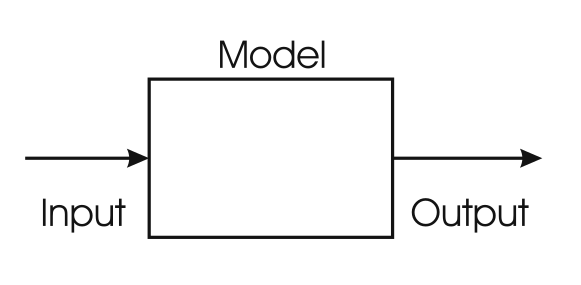
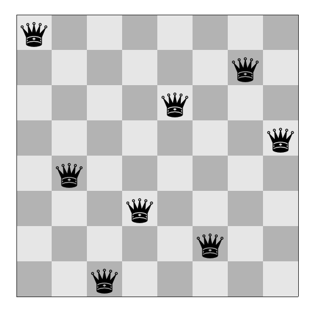
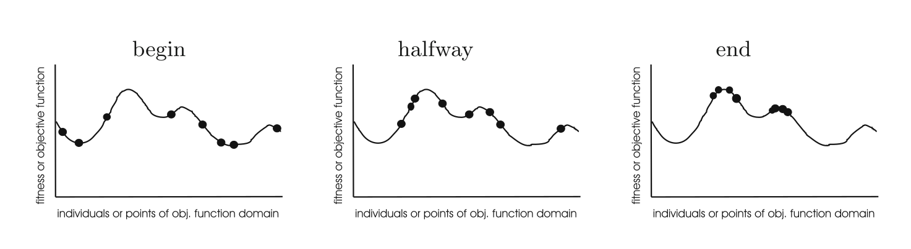
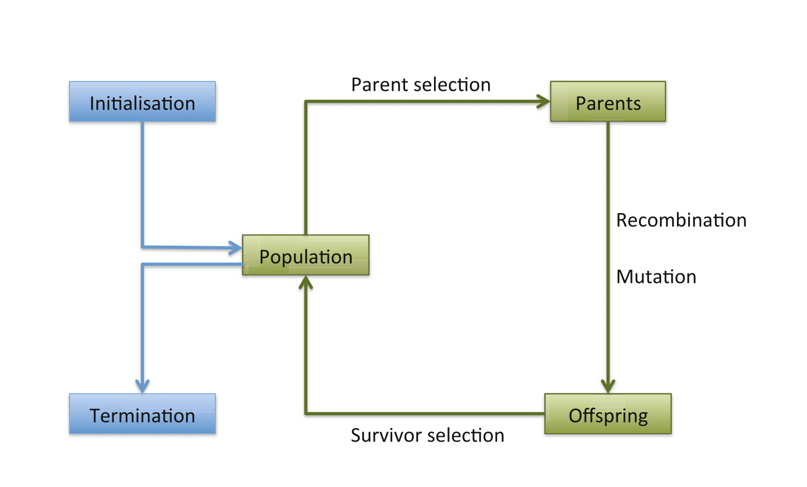
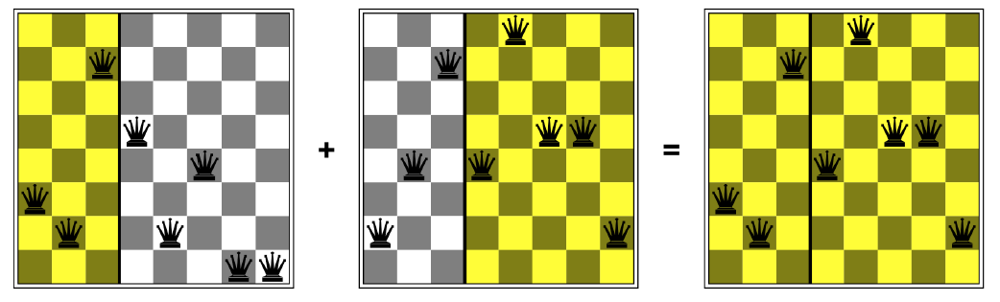
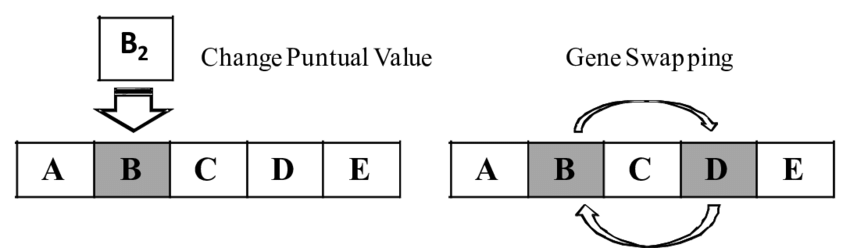
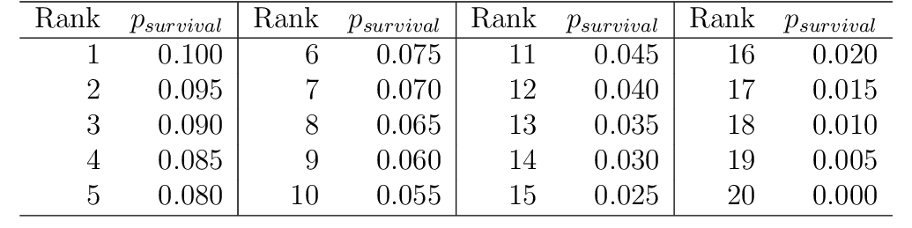
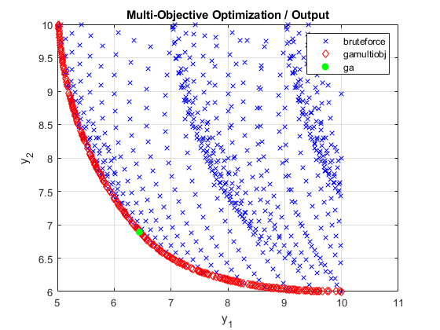

<!-- _class: lead -->

# IPD434
## Computación evolutiva
### Representación, variación, selección y evidencia

Dr. Nicolás Gálvez Ramírez 
Dr. Patricio Olivares Roncagliolo

---

## Conexión con las unidades anteriores

- La Unidad 1 mostró por qué algunos espacios no pueden recorrerse exhaustivamente.
- La Unidad 2 usó conocimiento experto para inferir una decisión.
- Esta unidad aborda problemas donde evaluar una solución es posible, pero encontrar la mejor es difícil.

$$
\text{candidato}\xrightarrow{\text{evaluaci\'on}}\text{calidad}
\quad\text{sin conocer una f\'ormula inversa para construir el \'optimo}
$$

---

## Objetivos de la unidad

Al finalizar se espera poder:

1. **Formular** un problema de optimización o satisfacción de restricciones.
2. **Diseñar** una representación y una función de aptitud coherentes.
3. **Explicar** exploración, explotación y diversidad.
4. **Aplicar** selección, recombinación, mutación y supervivencia.
5. **Implementar** un algoritmo genético con DEAP.
6. **Evaluar** resultados estocásticos con múltiples ejecuciones.

---

## Ruta de la clase

1. Formulamos qué debe optimizarse y qué restricciones se deben respetar.
2. Diseñamos una representación que permita producir candidatos válidos.
3. Traducimos la calidad del problema a una función de aptitud.
4. Alternamos selección, variación y supervivencia sin perder diversidad.
5. Evaluamos el método mediante repeticiones y presupuestos comparables.

Un algoritmo evolutivo no comienza con los operadores. Comienza con una formulación que define qué significa mejorar.

---

## Optimización como caja negra

Buscamos:

$$
x^*=\arg\min_{x\in\Omega}f(x)
$$

cuando $f$ puede ser no diferenciable, ruidosa, costosa o conocida solo mediante simulación.

La metaheurística decide qué candidatos evaluar bajo un presupuesto finito.

La expresión “caja negra” no significa que el problema carezca de estructura: indica que el algoritmo obtiene información principalmente al consultar $f(x)$, sin disponer de una solución analítica directa.

---

## Tres formulaciones

| Tipo | Pregunta | Resultado |
|---|---|---|
| FOP | Optimizar $f(x)$ sin restricciones explícitas | Mejor valor encontrado |
| CSP | Satisfacer $g_i(x)$ | Solución factible |
| CSOP | Optimizar $f(x)$ sujeto a $g_i(x)$ | Mejor solución factible |

Una penalización transforma restricciones en presión de búsqueda, pero su escala puede ocultar el objetivo principal.

FOP, CSP y CSOP corresponden, respectivamente, a optimización libre, satisfacción de restricciones y optimización con restricciones. Antes de elegir el algoritmo se debe decidir cuál de estas preguntas se desea responder.

---

## N reinas: representación

Una permutación $x=(x_1,\dots,x_n)$ puede indicar la fila de la reina en cada columna.

- No hay conflictos por columna.
- La permutación evita conflictos por fila.
- Se deben minimizar conflictos diagonales.

$$
C(x)=\sum_{i<j}\mathbf{1}\{|x_i-x_j|=|i-j|\}
$$

La función indicadora vale $1$ cuando dos reinas comparten una diagonal. Por tanto, $C(x)=0$ identifica una solución válida.

---

## Representación y operadores deben coincidir

Una codificación útil:

- representa toda solución relevante.
- evita o repara soluciones inválidas.
- admite variaciones pequeñas con significado.
- permite evaluar con costo razonable.

Un cruzamiento de un punto aplicado sin cuidado a permutaciones produce valores repetidos y soluciones inválidas.

---

## Búsqueda local y poblacional

**Búsqueda local**

- Mantiene uno o pocos candidatos.
- Explora un vecindario $N(x)$.
- Puede converger rápido a un óptimo local.

**Búsqueda poblacional**

- Mantiene candidatos diversos.
- Comparte información mediante recombinación.
- Requiere controlar costo y diversidad.

---

## Exploración y explotación

- **Exploración:** visitar regiones nuevas del espacio.
- **Explotación:** refinar regiones prometedoras.

Demasiada explotación causa convergencia prematura. Demasiada exploración impide consolidar mejoras.

La diversidad de la población permite explorar, mientras que la selección de candidatos de alta calidad dirige la explotación. Los operadores y sus probabilidades controlan ese equilibrio.

---

## Marco general de un algoritmo evolutivo

$$
P_t\xrightarrow{\text{selecci\'on}}P'_t
\xrightarrow{\text{variaci\'on}}O_t
\xrightarrow{\text{evaluaci\'on y supervivencia}}P_{t+1}
$$

El algoritmo termina por presupuesto, convergencia, calidad objetivo o ausencia de mejora.

Cada flecha representa una decisión de diseño. Cambiar selección, variación o reemplazo puede producir un comportamiento distinto aunque se conserve el mismo nombre general del algoritmo.

---

## Aptitud

La aptitud traduce el objetivo del problema a presión de selección.

Para minimizar conflictos:

$$
f(x)=C(x)
$$

o, si el operador exige maximizar:

$$
F(x)=\frac{1}{1+C(x)}
$$

La transformación debe preservar el orden relevante y evitar escalas que hagan casi indistinguibles a los candidatos.

En DEAP, el signo del peso de la aptitud indica minimización o maximización. Esto evita transformar artificialmente el objetivo solo para adecuarlo a la biblioteca.

---

## Selección de padres

| Método | Presión | Riesgo principal |
|---|---|---|
| Aleatoria | Nula | No explota calidad |
| Ruleta | Depende de escala | Dominio prematuro |
| Ordenamiento | Controlada | Pierde magnitud relativa |
| Torneo | Ajustable con tamaño $k$ | Baja diversidad con $k$ grande |

En un torneo de tamaño $k$, aumentar $k$ eleva la probabilidad de seleccionar individuos de alta aptitud.

La selección de padres no elimina individuos por sí sola: determina quién tendrá oportunidades de producir descendencia.

---

## Recombinación

Combina información de dos o más padres. En permutaciones se prefieren operadores que preservan la validez, como:

- partially mapped crossover (PMX).
- ordered crossover (OX).
- cycle crossover (CX).

La recombinación es útil cuando los bloques heredados conservan valor al combinarse.

En N reinas, OX conserva una subsecuencia de un padre y completa las posiciones restantes respetando el orden relativo del otro, sin repetir filas.

---

## Mutación

La mutación introduce variación y recupera alelos perdidos.

Ejemplos:

- bit flip para cadenas binarias.
- ruido gaussiano para vectores reales.
- intercambio, inserción o inversión para permutaciones.

Una tasa excesiva aproxima la búsqueda a muestreo aleatorio. Una tasa muy baja puede congelar la población.

Conviene distinguir la probabilidad de mutar un individuo de la probabilidad de modificar cada gen dentro de ese individuo.

---

## Supervivencia y elitismo

El reemplazo puede ser:

- **generacional:** la descendencia sustituye a la población.
- **estacionario:** se reemplazan pocos individuos.
- **elitista:** se preservan los mejores.

El elitismo protege el mejor valor hallado, pero en exceso reduce la diversidad.

La selección de supervivientes responde una pregunta diferente de la selección de padres: decide qué individuos estarán disponibles en la generación siguiente.

---

## Diversidad

La diversidad puede medirse sobre genotipo, fenotipo u objetivo.

Para una población binaria, una medida por locus es la entropía:

$$
H_j=-p_j\log p_j-(1-p_j)\log(1-p_j)
$$

Monitorear solo la mejor aptitud no permite distinguir una convergencia saludable de un colapso prematuro de la población.

Por ello conviene registrar simultáneamente el mejor valor, el promedio, la dispersión y alguna medida de distancia entre individuos.

---

## Familias evolutivas

| Familia | Énfasis histórico |
|---|---|
| Algoritmos genéticos (GA) | Cromosomas, selección y recombinación |
| Estrategias evolutivas (ES) | Vectores reales y auto-adaptación |
| Programación evolutiva (EP) | Mutación y competencia |
| Programación genética (GP) | Evolución de árboles o programas |

La frontera actual es flexible: conviene describir representación, operadores y reemplazo en vez de inferirlos solo por el nombre.

---

## Multiobjetivo

Cuando existen objetivos en conflicto, no siempre hay un único mejor candidato.

Una solución $x$ domina a $y$ si:

$$
f_i(x)\le f_i(y)\ \forall i
\quad\text{y}\quad
f_j(x)<f_j(y)\ \text{para alg\'un }j
$$

El conjunto de soluciones no dominadas aproxima el frente de Pareto.

Elegir una solución del frente requiere preferencias adicionales. El algoritmo identifica compromisos, pero no decide por sí solo cuál objetivo debe priorizarse.

---

## Configuración de parámetros

Parámetros típicos:

- tamaño de población $\mu$.
- probabilidad de cruzamiento $p_c$.
- probabilidad de mutación $p_m$.
- presión de selección.
- presupuesto de generaciones o evaluaciones.

La comparación entre configuraciones debe usar el mismo presupuesto de evaluaciones y varias semillas. Una única ejecución no caracteriza un algoritmo estocástico.

---

## Ejemplo ejecutable: N reinas

El notebook [`notebook/03_ga_n_reinas.ipynb`](notebook/03_ga_n_reinas.ipynb):

- representa cada tablero como permutación.
- minimiza conflictos diagonales.
- usa torneo, OX, mutación por intercambio y elitismo.
- registra mejor y promedio por generación.
- repite el experimento con semillas explícitas.

DEAP separa tipos, operadores y algoritmo, facilitando reemplazar componentes sin ocultar su función.

---

## Protocolo experimental

1. Definir instancia y presupuesto.
2. Establecer una línea base aleatoria o heurística simple.
3. Ejecutar $r$ semillas independientes.
4. Reportar éxito, costo y distribución de calidad.
5. Graficar convergencia respecto de evaluaciones.
6. Analizar sensibilidad a parámetros.

$$
\hat p_{\text{\'exito}}=\frac{\text{ejecuciones que alcanzan el objetivo}}{r}
$$

---

## Síntesis

- Una metaheurística administra un presupuesto de evaluaciones.
- Representación, aptitud y operadores forman un diseño inseparable.
- Selección explota. Variación y diversidad sostienen exploración.
- El resultado estocástico exige repeticiones y comparaciones justas.
- DEAP implementa el ciclo, pero no decide la formulación correcta.

La próxima unidad cambia poblaciones de soluciones por parámetros aprendidos desde datos: redes neuronales y descenso de gradiente.

---

## Referencias

- Material original de IPD434: `03_ComputacionEvolutiva.ipynb` y `03_DEAP.ipynb`.
- A. E. Eiben y J. E. Smith, *Introduction to Evolutionary Computing*, 2.ª ed., Springer, 2015.
- D. E. Goldberg, *Genetic Algorithms in Search, Optimization, and Machine Learning*, 1989.
- K. Deb, *Multi-Objective Optimization Using Evolutionary Algorithms*, Wiley, 2001.
- DEAP, documentación oficial y tutoriales de tipos, operadores y algoritmos.
