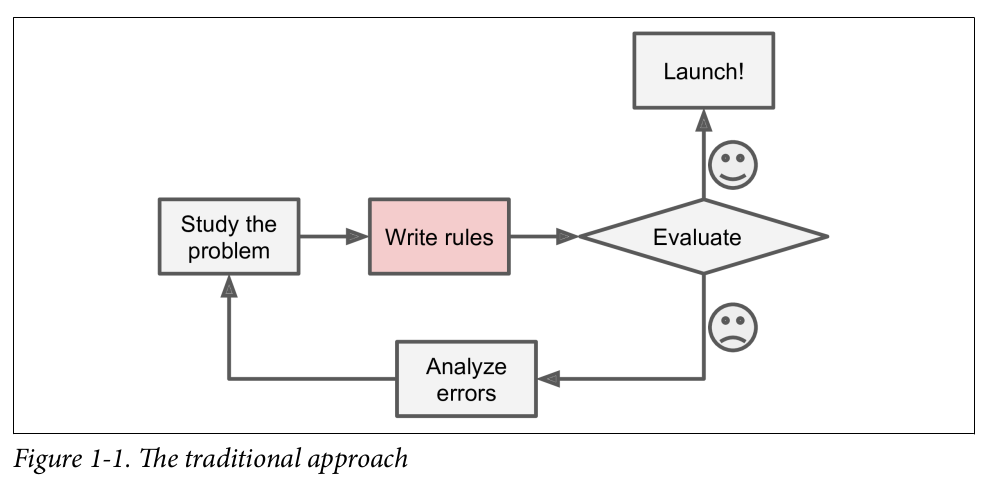
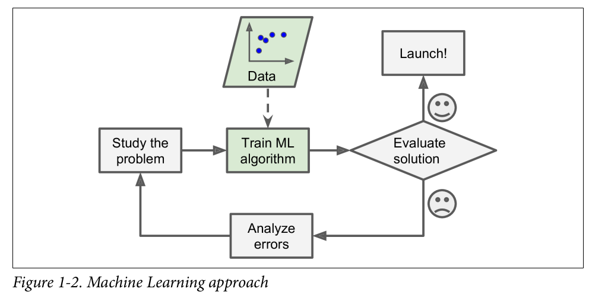
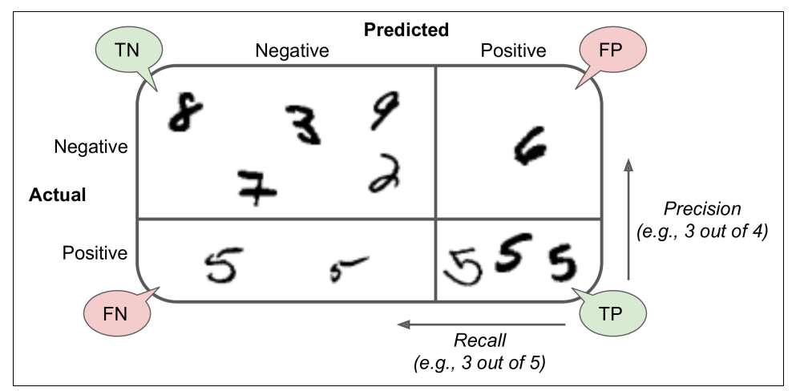
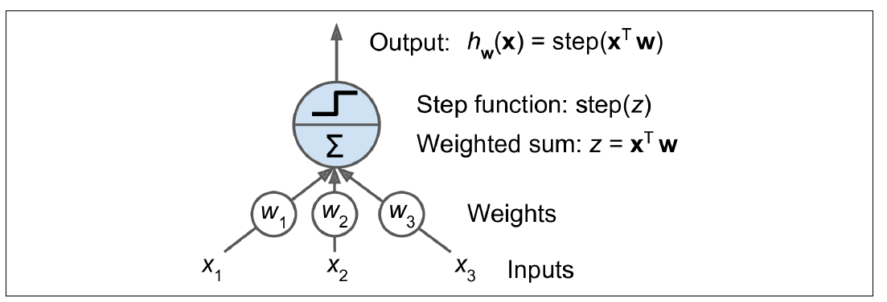
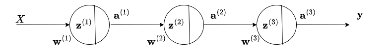
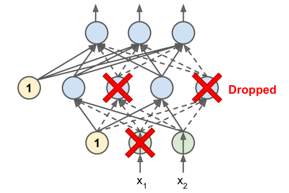
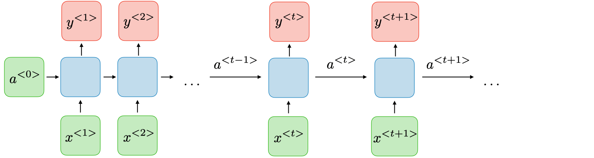
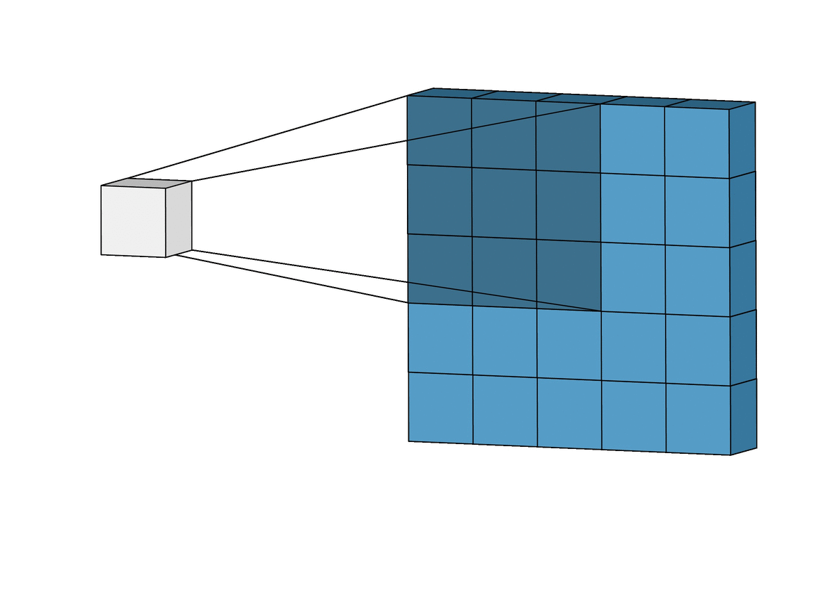
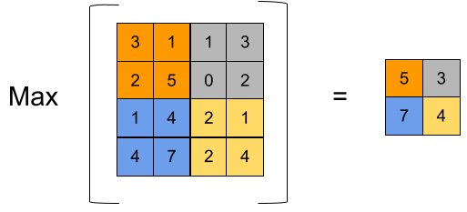
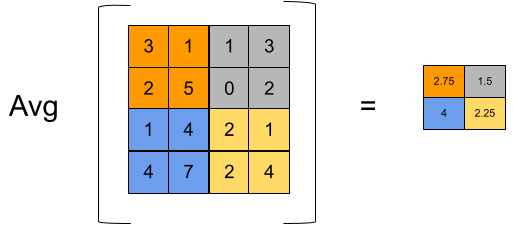

<!-- _class: lead -->

# IPD434
## Redes neuronales
### De evaluación de datos a arquitecturas profundas

Dr. Nicolás Gálvez Ramírez 
Dr. Patricio Olivares Roncagliolo

---

## Conexión con el curso

- Los sistemas difusos codifican conocimiento mediante membresías y reglas.
- Los algoritmos evolutivos buscan soluciones mediante poblaciones.
- Las redes neuronales ajustan parámetros a partir de ejemplos.

$$
\mathcal D=\{(x_i,y_i)\}_{i=1}^{n}
\xrightarrow{\text{entrenamiento}}
f_\theta(x)
$$

El modelo aprende regularidades de los datos; no aprende automáticamente el objetivo real ni corrige un diseño experimental deficiente.

---

## Objetivos de la unidad

Al finalizar se espera poder:

1. **Formular** tareas de clasificación y regresión.
2. **Separar** entrenamiento, validación y prueba sin fuga de información.
3. **Seleccionar** métricas coherentes con el costo de los errores.
4. **Explicar** perceptrón, descenso de gradiente y retropropagación.
5. **Diseñar** una red multicapa con regularización.
6. **Distinguir** cuándo utilizar capas densas, recurrentes o convolucionales.

---

## ¿Cuándo usar aprendizaje automático?

**Programación explícita**

Una persona debe anticipar los patrones, escribir las reglas y mantener sus excepciones.

**Aprendizaje desde ejemplos**

El modelo ajusta sus parámetros para capturar regularidades presentes en los datos.

No es la opción adecuada si una regla simple resuelve el problema con mayor seguridad, ni cuando los datos disponibles no representan el contexto de uso.

---

## Formulación supervisada

En clasificación:

$$
f_\theta:\mathbb R^d\rightarrow\{1,\dots,K\}
$$

En regresión:

$$
f_\theta:\mathbb R^d\rightarrow\mathbb R^m
$$

Se estiman parámetros $\theta$ minimizando una pérdida empírica:

$$
\hat\theta=\arg\min_\theta\frac{1}{n}\sum_{i=1}^{n}
\ell\big(y_i,f_\theta(x_i)\big)
$$

$x_i$ contiene las características de una observación, $y_i$ es su objetivo conocido y $\ell$ cuantifica el costo de la predicción. Entrenar consiste en ajustar $\theta$ para reducir ese costo.

---

## Particiones del conjunto de datos

| Partición | Uso | ¿Ajusta decisiones? |
|---|---|---|
| Entrenamiento | Estimar parámetros | Sí |
| Validación | Elegir hiperparámetros y detener | Sí |
| Prueba | Estimar desempeño final | No |

Preprocesar con estadísticas calculadas sobre todos los datos, seleccionar modelos mirando prueba o duplicar muestras entre particiones produce fuga de información.

---

## Matriz de confusión binaria

| | Predice positivo | Predice negativo |
|---|---:|---:|
| Real positivo | $TP$ | $FN$ |
| Real negativo | $FP$ | $TN$ |

El significado de “positivo” debe asociarse a la condición relevante, no necesariamente a la clase más frecuente.

$TP$ y $TN$ son aciertos; $FP$ es una falsa alarma y $FN$ una omisión. La importancia de cada error depende del problema, no de la tabla.

---

## Métricas de clasificación

$$
\text{exactitud}=\frac{TP+TN}{TP+TN+FP+FN}
$$

$$
\text{precisión}=\frac{TP}{TP+FP},\qquad
\text{exhaustividad}=\frac{TP}{TP+FN}
$$

$$
\text{specificity}=\frac{TN}{TN+FP}
$$

$$
F_1=2\frac{\text{precisión}\cdot\text{exhaustividad}}
{\text{precisión}+\text{exhaustividad}}
$$

La precisión responde “¿cuántos positivos predichos eran correctos?”; la exhaustividad o *recall* responde “¿cuántos positivos reales fueron detectados?”.

---

## Elegir una métrica

- Exactitud (*accuracy*): clases balanceadas y costos semejantes.
- Exhaustividad o sensibilidad (*recall*): omitir un positivo es costoso.
- Precisión (*precision*): una falsa alarma es costosa.
- $F_1$: compromiso entre precisión y exhaustividad.
- ROC-AUC o PR-AUC: comparar puntajes a través de umbrales.

En detección de fallas raras, una exactitud de $99\%$ puede obtenerse prediciendo siempre “sin falla”. La métrica debe reflejar la decisión operacional.

---

## Métricas de regresión

$$
MAE=\frac{1}{n}\sum_{i=1}^{n}|y_i-\hat y_i|
$$

$$
MSE=\frac{1}{n}\sum_{i=1}^{n}(y_i-\hat y_i)^2,
\qquad RMSE=\sqrt{MSE}
$$

$$
R^2=1-\frac{\sum_i(y_i-\hat y_i)^2}{\sum_i(y_i-\bar y)^2}
$$

MAE es más robusto a errores extremos; MSE los penaliza con mayor fuerza.

RMSE conserva la unidad de la variable objetivo. $R^2$ compara contra predecir siempre la media y puede ser negativo sobre datos de prueba.

---

## Perceptrón

$$
z=\mathbf w^\top\mathbf x+b,\qquad
\hat y=\phi(z)
$$

El perceptrón aprende una frontera lineal. Si las clases no son linealmente separables, una sola unidad no puede resolver el problema sin transformar las características.

Los pesos determinan la orientación de la frontera y el sesgo $b$ permite desplazarla respecto del origen.

---

## Red multicapa

Para la capa $l$:

$$
\mathbf z^{(l)}=W^{(l)}\mathbf a^{(l-1)}+\mathbf b^{(l)},\qquad
\mathbf a^{(l)}=\phi^{(l)}(\mathbf z^{(l)})
$$

Componer transformaciones lineales con activaciones no lineales permite representar fronteras complejas.

Sin activaciones no lineales, varias capas densas consecutivas se reducen algebraicamente a una sola transformación lineal.

---

## Descenso de gradiente

Se actualizan parámetros en dirección opuesta al gradiente:

$$
\theta_{t+1}=\theta_t-\eta\nabla_\theta L(\theta_t)
$$

donde $\eta$ es la tasa de aprendizaje.

- $\eta$ muy grande: oscilación o divergencia.
- $\eta$ muy pequeña: convergencia lenta.
- Mini-batches: estimación ruidosa pero eficiente del gradiente.

Una época corresponde a recorrer una vez el conjunto de entrenamiento; una actualización ocurre por cada mini-lote procesado.

---

## Retropropagación

La regla de la cadena propaga derivadas desde la pérdida hacia cada capa.

$$
\frac{\partial L}{\partial W^{(l)}}
=
\frac{\partial L}{\partial \mathbf z^{(l)}}
\frac{\partial \mathbf z^{(l)}}{\partial W^{(l)}}
$$

Retropropagación calcula gradientes; un optimizador como SGD o Adam usa esos gradientes para actualizar parámetros.

El procedimiento reutiliza derivadas intermedias desde la salida hacia la entrada, lo que evita calcular por separado el efecto de cada parámetro.

---

## Funciones de activación

| Activación | Expresión | Uso habitual |
|---|---|---|
| Sigmoide | $\sigma(z)=1/(1+e^{-z})$ | Salida binaria |
| Tanh | $\tanh(z)$ | Estados centrados en cero |
| ReLU | $\max(0,z)$ | Capas ocultas |
| Leaky ReLU | $\max(\alpha z,z)$ | Evitar unidades inactivas |
| Softmax | $e^{z_k}/\sum_j e^{z_j}$ | Salida multiclase |

La activación de salida debe corresponder a la codificación de etiquetas y a la función de pérdida.

Por ejemplo, clasificación binaria suele combinar una salida sigmoide con entropía cruzada binaria; clasificación multiclase excluyente usa *softmax*.

---

## Entropía cruzada multiclase

Para etiqueta one-hot $\mathbf y$ y probabilidades $\hat{\mathbf p}$:

$$
L=-\sum_{k=1}^{K}y_k\log\hat p_k
$$

con:

$$
\hat p_k=\frac{e^{z_k}}{\sum_j e^{z_j}}
$$

La clase predicha puede ser $\arg\max_k\hat p_k$, pero las probabilidades requieren calibración si se usarán para decisiones de riesgo.

Minimizar esta pérdida aumenta la probabilidad asignada a la clase correcta y penaliza con fuerza las predicciones confiadas que resultan equivocadas.

---

## Subajuste y sobreajuste

**Subajuste**

- Error alto en entrenamiento.
- Modelo o características insuficientes.
- Optimización incompleta.

**Sobreajuste**

- Error bajo en entrenamiento.
- Brecha alta en validación.
- El modelo memoriza particularidades.

El objetivo es generalización: buen desempeño sobre datos no utilizados para ajustar decisiones.

---

## Regularización

Penalización $L_2$:

$$
L_{total}=L_{datos}+\lambda\sum_j w_j^2
$$

Penalización $L_1$:

$$
L_{total}=L_{datos}+\lambda\sum_j|w_j|
$$

Otras estrategias:

- dropout;
- detención temprana;
- aumento de datos;
- reducción de capacidad.

$L_1$ favorece pesos exactamente nulos; $L_2$ reduce su magnitud de manera suave. El valor de $\lambda$ se elige usando validación.

---

## Dropout y detención temprana

Durante el entrenamiento, *dropout* anula activaciones con probabilidad $p$ y reduce la coadaptación.

Durante inferencia no se eliminan unidades; la biblioteca ajusta la escala para mantener compatible el valor esperado de las activaciones.

La detención temprana conserva el punto de mejor validación:

$$
t^*=\arg\min_t L_{validación}(t)
$$

La prueba se evalúa una vez, después de fijar $t^*$ y todas las decisiones.

---

## Redes recurrentes

Una RNN actualiza un estado oculto:

$$
\mathbf h_t=\phi(W_x\mathbf x_t+W_h\mathbf h_{t-1}+\mathbf b)
$$

LSTM y GRU agregan compuertas para controlar memoria y flujo del gradiente en secuencias largas.

El estado $\mathbf h_t$ resume la información previa que el modelo considera útil para procesar $\mathbf x_t$.

---

## Patrones de entrada y salida secuencial

| Patrón | Ejemplo |
|---|---|
| Uno a muchos | Generación de secuencia |
| Muchos a uno | Clasificación de texto o serie |
| Muchos a muchos, alineado | Etiquetado por instante |
| Muchos a muchos, no alineado | Traducción secuencia a secuencia |

Las particiones temporales deben respetar causalidad; mezclar aleatoriamente observaciones futuras puede filtrar información.

---

## Redes convolucionales

Para una convolución discreta 2D:

$$
Y_{i,j}=\sum_m\sum_n K_{m,n}X_{i+m,j+n}
$$

Los pesos compartidos detectan patrones locales en distintas posiciones con menos parámetros que una capa totalmente conectada.

Cada filtro produce un mapa de características. Capas sucesivas combinan patrones simples para construir representaciones de mayor nivel.

---

## Agrupación espacial

**Agrupación por máximo (*max pooling*):** conserva la activación máxima de una región.

**Agrupación por promedio (*average pooling*):** conserva el promedio de la región.

La agrupación (*pooling*) reduce la resolución y el costo, pero también descarta información espacial.

El tamaño de ventana y el paso determinan cuánto se reduce la representación; una reducción agresiva puede eliminar detalles relevantes.

---

## Diseñar un experimento neuronal

1. Definir tarea, población y métrica.
2. Construir una línea base simple.
3. Separar datos antes de ajustar transformaciones.
4. Entrenar con semillas y presupuesto explícitos.
5. Seleccionar con validación.
6. Evaluar una vez sobre prueba.
7. Analizar errores por clase, segmento o condición.

Una red más profunda solo es una mejor solución si mejora la métrica relevante bajo una comparación justa y un costo aceptable.

---

## Ejemplo ejecutable

El notebook [`notebooks/04_clasificacion_fashion_mnist.ipynb`](notebooks/04_clasificacion_fashion_mnist.ipynb):

- normaliza imágenes de Fashion-MNIST;
- separa entrenamiento, validación y prueba;
- entrena una red densa con dropout;
- usa detención temprana;
- calcula la matriz de confusión y la exactitud por clase.

El ejemplo sigue la API `tf.keras` y deja explícitas las semillas y la partición.

---

## Síntesis

- El diseño comienza por tarea, datos y métrica, no por la arquitectura.
- Retropropagación calcula gradientes; el optimizador actualiza parámetros.
- Regularización y validación controlan generalización.
- RNN modelan dependencia secuencial; CNN explotan estructura local.
- La evaluación final debe permanecer aislada del ajuste.

La Unidad 5 profundiza en dos rutas: metaheurísticas bioinspiradas y arquitecturas neuronales especializadas.

---

## Referencias

- Material original de IPD434: `04_RedesNeuronales.ipynb`.
- I. Goodfellow, Y. Bengio y A. Courville, *Deep Learning*, MIT Press, 2016.
- C. M. Bishop, *Pattern Recognition and Machine Learning*, Springer, 2006.
- F. Chollet, *Deep Learning with Python*, 2.ª ed., Manning, 2021.
- TensorFlow/Keras, documentación oficial de clasificación y modelos secuenciales.
