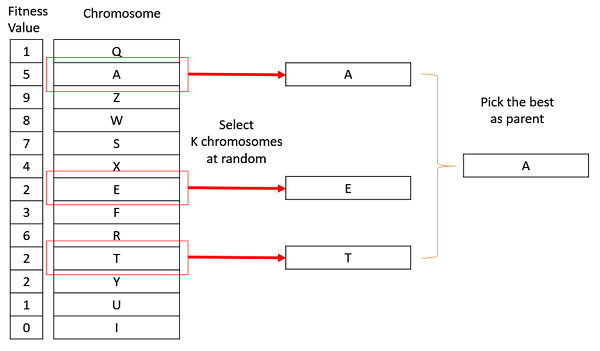
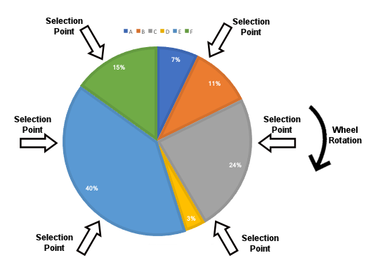
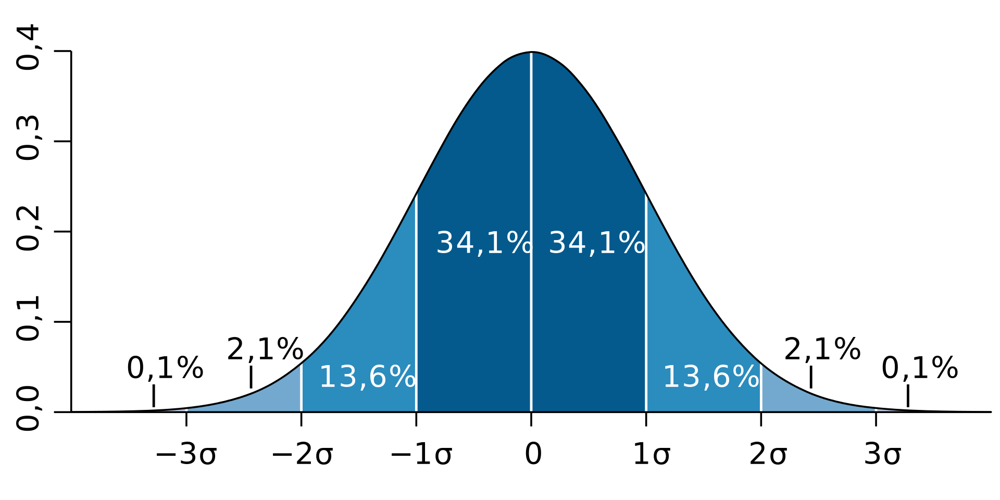
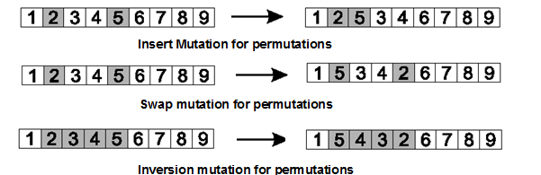
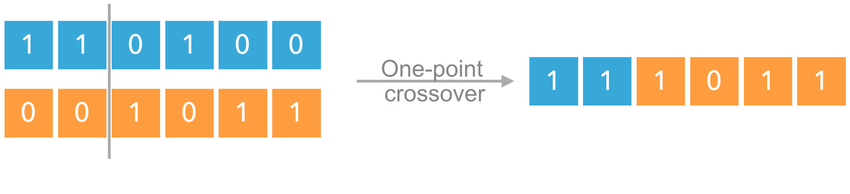
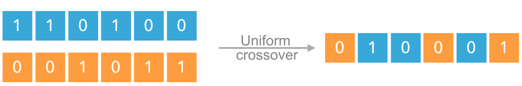
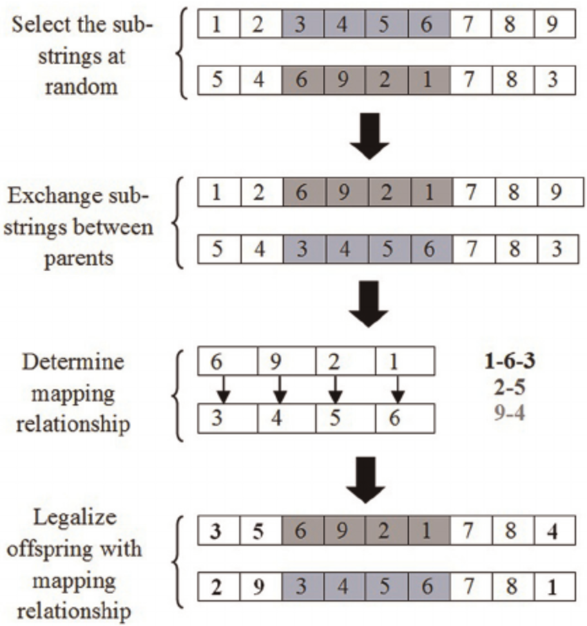
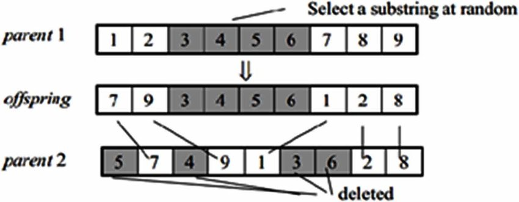
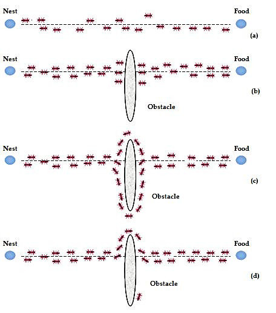
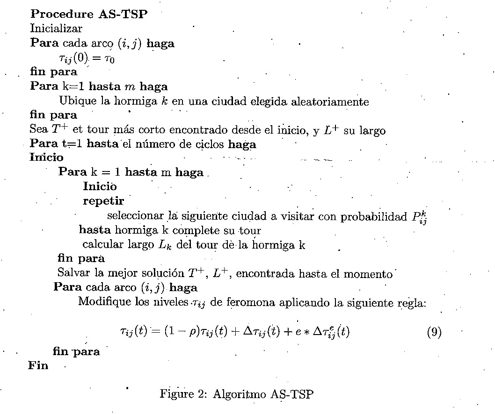

<!-- _class: lead -->

# IPD434
## Computación evolutiva avanzada
### Operadores, colonias de hormigas y enjambres

Dr. Nicolás Gálvez Ramírez 
Dr. Patricio Olivares Roncagliolo

---

## Conexión con la unidad base

La unidad de computación evolutiva introdujo el ciclo:

$$
\text{representar}\rightarrow\text{evaluar}\rightarrow
\text{seleccionar}\rightarrow\text{variar}\rightarrow\text{reemplazar}
$$

Esta especialidad estudia:

- cómo los operadores cambian la presión de búsqueda.
- cómo escoger operadores compatibles con la representación.
- cómo ACO y PSO comparten información sin recombinación genética clásica.

---

## Objetivos

Al finalizar se espera poder:

1. **Comparar** métodos de selección y supervivencia.
2. **Elegir** mutación y recombinación según la codificación.
3. **Explicar** el rol de feromona y heurística en ACO.
4. **Explicar** la dinámica de velocidad y memoria en PSO.
5. **Implementar** ACO para el problema del vendedor viajero.
6. **Diseñar** comparaciones con igual presupuesto y múltiples semillas.

---

## Ruta de la clase

1. Profundizamos en presión de selección, variación y reemplazo.
2. Relacionamos cada operador con la representación que debe preservar.
3. Abandonamos la reproducción genética clásica para estudiar coordinación colectiva.
4. ACO comparte información mediante feromonas en problemas constructivos.
5. PSO combina memoria individual y social en espacios continuos.
6. Comparamos todos los métodos con el mismo presupuesto experimental.

---

## Selección: controlar la presión

| Método | Parámetro relevante | Consecuencia |
|---|---|---|
| Torneo | Tamaño $k$ | Mayor $k$, mayor presión |
| Ordenamiento | Función de rango | Independiente de la escala de aptitud |
| Ruleta | Aptitud relativa | Sensible a valores extremos |
| SUS | Número de punteros | Menor varianza de muestreo |

La presión debe favorecer a los mejores sin eliminar demasiado rápido alternativas que podrían producir descendencia útil.

---

## Ruleta y muestreo universal

Para aptitudes positivas:

$$
p_i=\frac{f_i}{\sum_j f_j}
$$

La ruleta realiza sorteos independientes. Stochastic Universal Sampling (SUS) usa punteros igualmente espaciados sobre una sola ruleta.

SUS reduce la variabilidad de la selección, pero no corrige una escala de aptitud mal condicionada.

La ruleta puede seleccionar demasiadas o muy pocas copias por azar. SUS distribuye los punteros uniformemente y conserva mejor las proporciones esperadas.

---

## Mutación según representación

**Vector real**

$$
x'_j=x_j+\epsilon,\qquad
\epsilon\sim\mathcal N(0,\sigma^2)
$$

**Permutación**

- intercambio.
- inserción.
- inversión.

El tamaño de la perturbación también importa: una inversión larga explora una región distinta de la obtenida al intercambiar dos posiciones cercanas.

---

## Recombinación binaria o real

- Un punto: intercambia sufijos.
- $k$ puntos: alterna segmentos.
- Uniforme: decide cada gen mediante una máscara.

La localidad del cromosoma determina si un segmento heredado conserva significado.

En vectores reales también puede utilizarse recombinación aritmética, donde los hijos se construyen como combinaciones ponderadas de sus padres.

---

## Recombinación de permutaciones

**PMX**

Conserva posiciones y establece un mapeo para evitar elementos repetidos.

**OX**

Conserva el orden relativo de los elementos fuera del segmento copiado.

No existe un operador universalmente mejor: la codificación y la estructura del problema determinan qué información conviene heredar.

PMX favorece correspondencias de posición. OX favorece relaciones de precedencia. En rutas, la elección depende de cuál relación representa mejor la estructura útil.

---

## Supervivencia

Estrategias frecuentes:

- $(\mu,\lambda)$: sobreviven solo descendientes.
- $(\mu+\lambda)$: compiten padres y descendientes.
- elitismo explícito.
- edad máxima.
- ordenamiento con preservación de diversidad.

El reemplazo define cuánto dura la memoria de la población. Preservar siempre a demasiados individuos puede impedir la adaptación.

---

## De evolución a inteligencia de enjambre

Los algoritmos de enjambre modelan agentes simples que comparten información indirecta o directa.

| Algoritmo | Memoria compartida | Movimiento |
|---|---|---|
| ACO | Feromona sobre componentes | Construcción probabilística |
| PSO | Mejor global o vecinal | Desplazamiento en espacio continuo |

No requieren cruzamiento y mutación con la semántica de un algoritmo genético.

En ACO la coordinación es indirecta mediante el entorno. En PSO cada partícula actualiza su movimiento usando memorias individuales y sociales.

---

## Ant Colony Optimization

Cada hormiga construye una solución. La probabilidad de escoger el arco $(i,j)$ es:

$$
p_{ij}^{(k)}=
\frac{\tau_{ij}^{\alpha}\eta_{ij}^{\beta}}
{\sum_{l\in N_i^{(k)}}\tau_{il}^{\alpha}\eta_{il}^{\beta}}
$$

donde $\tau$ es feromona y $\eta$ información heurística.

$\alpha$ controla el peso de la experiencia acumulada y $\beta$ el de la conveniencia local. Si $\alpha$ domina demasiado, la colonia puede quedar atrapada en decisiones tempranas.

---

## Actualización de feromona

Evaporación y depósito:

$$
\tau_{ij}\leftarrow(1-\rho)\tau_{ij}+\sum_k\Delta\tau_{ij}^{(k)}
$$

Para TSP puede utilizarse:

$$
\Delta\tau_{ij}^{(k)}=
\begin{cases}
Q/L_k,&(i,j)\in\text{tour}_k\\
0,&\text{otro caso}
\end{cases}
$$

La evaporación evita que decisiones tempranas sean irreversibles.

El depósito refuerza componentes de buenas soluciones. La evaporación reduce gradualmente su influencia y mantiene abierta la exploración de otras rutas.

---

## ACO aplicado a TSP

1. Inicializar feromona.
2. Construir tours probabilísticos.
3. Evaluar longitudes.
4. Evaporar feromona.
5. Depositar según calidad.
6. Actualizar la mejor solución.

La heurística usual es $\eta_{ij}=1/d_{ij}$.

Esta heurística prefiere ciudades cercanas, mientras la feromona incorpora evidencia histórica sobre arcos que participaron en recorridos competitivos.

---

## Particle Swarm Optimization

Cada partícula mantiene posición $x_i$, velocidad $v_i$, mejor personal $p_i$ y mejor social $g$.

$$
v_i(t+1)=\omega v_i(t)
+c_1r_1[p_i-x_i(t)]
+c_2r_2[g-x_i(t)]
$$

$$
x_i(t+1)=x_i(t)+v_i(t+1)
$$

- $\omega$: inercia.
- $c_1$: memoria individual.
- $c_2$: influencia social.

Los factores $r_1,r_2\sim U(0,1)$ introducen variación. Una inercia alta favorece exploración. Una baja facilita la estabilización local.

---

## Comparación conceptual

| Aspecto | GA | ACO | PSO |
|---|---|---|---|
| Solución | Cromosoma | Ruta construida | Posición |
| Información | Padres | Feromona | Mejores posiciones |
| Espacio típico | Discreto o continuo | Combinatorio | Continuo |
| Variación | Cruce y mutación | Decisión probabilística | Velocidad |
| Riesgo | Convergencia prematura | Estancamiento de feromona | Colapso del enjambre |

---

## Ejemplo ejecutable

El notebook [`notebook/05_aco_tsp.ipynb`](notebook/05_aco_tsp.ipynb):

- genera una instancia euclidiana reproducible.
- construye tours con feromona y distancia.
- aplica evaporación y depósito elitista.
- grafica convergencia y mejor tour.
- compara varias semillas.

El código usa NumPy y Matplotlib para hacer visible el algoritmo completo.

---

## Diseño experimental avanzado

- Mismo número de evaluaciones de función objetivo.
- Misma instancia y condiciones de término.
- Varias semillas independientes.
- Comparación con heurística simple.
- Mediana, dispersión y tasa de éxito.
- Tiempo y memoria cuando importen.

Comparar el mejor resultado publicado de un algoritmo con una sola ejecución propia de otro no permite concluir superioridad.

---

## Síntesis

- La presión de selección y supervivencia controla cuánto se explota.
- Los operadores deben preservar la semántica de la representación.
- ACO combina feromona histórica e información heurística.
- PSO combina inercia, memoria individual e información social.
- La elección del algoritmo depende de la estructura del problema y de evidencia comparable.

La otra rama de especialidad profundiza el aprendizaje neuronal: refuerzo, transformers, modelos generativos y CNN avanzadas.

---

## Referencias

- Material original de IPD434: `05_EA_Avanzado.ipynb`.
- M. Dorigo y T. Stützle, *Ant Colony Optimization*, MIT Press, 2004.
- J. Kennedy y R. Eberhart, “Particle Swarm Optimization”, 1995.
- A. E. Eiben y J. E. Smith, *Introduction to Evolutionary Computing*, 2.ª ed., 2015.
