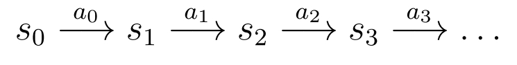
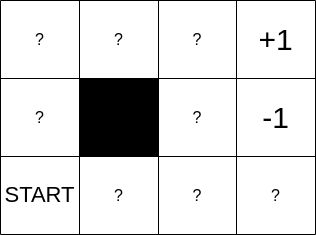
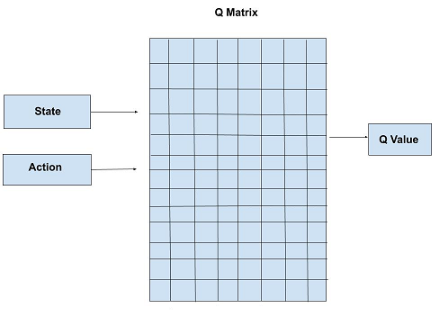

<!-- _class: lead -->

# IPD434
## Aprendizaje por refuerzo
### Decisiones secuenciales, valor y aprendizaje Q profundo

Dr. Nicolás Gálvez Ramírez<br>
Dr. Patricio Olivares Roncagliolo

---

## Conexión con redes neuronales

En aprendizaje supervisado cada entrada viene acompañada por una etiqueta.

En aprendizaje por refuerzo (RL), un agente actúa, modifica el entorno y recibe una recompensa posiblemente tardía.

$$
s_t\xrightarrow{a_t}\left(r_{t+1},s_{t+1}\right)
$$

<div class="bridge">
La pregunta cambia desde “¿qué etiqueta corresponde?” hacia “¿qué acción maximiza el retorno futuro?”.
</div>

---

## Objetivos

1. **Formalizar** un problema como proceso de decisión de Markov.
2. **Distinguir** política, recompensa, retorno y funciones de valor.
3. **Aplicar** ecuaciones de Bellman y value iteration.
4. **Explicar** exploración frente a explotación.
5. **Implementar** Q-learning tabular con Gymnasium.
6. **Relacionar** Q-learning y DQN, incluyendo sus mecanismos de estabilidad.

---

## Ruta de la clase

1. Modelamos estados, acciones, transiciones y recompensas mediante un MDP.
2. Convertimos recompensas futuras en retorno y funciones de valor.
3. La ecuación de Bellman conecta una decisión actual con decisiones futuras.
4. *Value iteration* resuelve el problema cuando conocemos el modelo.
5. Q-learning aprende desde experiencia cuando el modelo no está disponible.
6. DQN aproxima la tabla Q con una red y requiere mecanismos de estabilización.

---

## Proceso de decisión de Markov

Un MDP se define por la tupla:

$$
\mathcal M=(\mathcal S,\mathcal A,P,R,\gamma)
$$

- $\mathcal S$: estados.
- $\mathcal A$: acciones.
- $P(s'\mid s,a)$: dinámica.
- $R(s,a,s')$: recompensa.
- $\gamma\in[0,1)$: descuento.



El estado contiene la información disponible para decidir. La dinámica describe qué puede ocurrir después de cada acción y la recompensa expresa el objetivo inmediato.

---

## Propiedad de Markov

El estado debe resumir la información relevante para predecir el futuro:

$$
P(s_{t+1}\mid s_t,a_t,s_{t-1},a_{t-1},\dots)
=P(s_{t+1}\mid s_t,a_t)
$$

Si la observación no contiene esa información, el agente enfrenta observabilidad parcial y el modelo ya no es un MDP completamente observable.

La propiedad no exige que el entorno sea determinista. Exige que, conocido el estado actual y la acción, el historial no aporte información adicional sobre la transición siguiente.

---

## Política y retorno

Una política estocástica asigna probabilidades a acciones:

$$
\pi(a\mid s)=P(A_t=a\mid S_t=s)
$$

El retorno descontado es:

$$
G_t=\sum_{k=0}^{\infty}\gamma^kR_{t+k+1}
$$

$\gamma$ controla cuánto pesan recompensas lejanas y garantiza convergencia de la suma en tareas continuas acotadas.

Con $\gamma=0$ el agente considera solo la recompensa inmediata. Cuando $\gamma$ se acerca a $1$, las consecuencias futuras adquieren mayor importancia.

---

## Funciones de valor

Valor de estado:

$$
V^\pi(s)=\mathbb E_\pi[G_t\mid S_t=s]
$$

Valor estado–acción:

$$
Q^\pi(s,a)=\mathbb E_\pi[G_t\mid S_t=s,A_t=a]
$$

Una política codiciosa respecto de $Q$ elige:

$$
\pi(s)=\arg\max_a Q(s,a)
$$

$V^\pi$ resume la calidad de estar en un estado y seguir $\pi$. $Q^\pi$ permite comparar directamente las acciones disponibles en ese estado.

---

## Ecuación de Bellman óptima

$$
V^*(s)=\max_a\sum_{s'}P(s'\mid s,a)
\left[R(s,a,s')+\gamma V^*(s')\right]
$$

Bellman expresa un principio recursivo: una decisión óptima combina recompensa inmediata con el valor óptimo del estado siguiente.

La esperanza pondera todos los estados siguientes posibles mediante $P(s'\mid s,a)$. El máximo selecciona la acción con mayor retorno esperado.

---

## Value iteration

Actualización iterativa:

$$
V_{k+1}(s)=\max_a\sum_{s'}P(s'\mid s,a)
\left[R(s,a,s')+\gamma V_k(s')\right]
$$

Termina cuando:

$$
\max_s|V_{k+1}(s)-V_k(s)|<\varepsilon
$$

Requiere conocer o estimar la dinámica $P$ y la recompensa.

Se parte de una estimación inicial, por ejemplo $V_0(s)=0$, y se aplican barridos hasta que los valores cambian menos que la tolerancia establecida.

---

## Mundo grilla



La misma política puede cambiar si:

- las acciones son estocásticas.
- existe descuento.
- cambia el costo por paso.
- cambia la recompensa terminal.

El modelado de recompensa define el comportamiento que realmente se optimiza.

Una penalización por paso favorece rutas cortas. Una transición estocástica puede hacer preferible un camino más largo, pero con menor riesgo de caer en un estado terminal negativo.

---

## Q-learning

Q-learning aprende sin un modelo explícito de $P$:

$$
Q(s_t,a_t)\leftarrow Q(s_t,a_t)+\alpha
\left[r_{t+1}+\gamma\max_aQ(s_{t+1},a)-Q(s_t,a_t)\right]
$$

El término entre corchetes es el error temporal (TD).



$\alpha$ determina cuánto se corrige la estimación actual y $\gamma$ cuánto valor se atribuye al mejor futuro estimado. La actualización se realiza después de cada transición observada.

---

## Exploración y explotación

Política $\varepsilon$-greedy:

$$
a_t=
\begin{cases}
\text{acci\'on aleatoria},&u<\varepsilon\\
\arg\max_a Q(s_t,a),&u\ge\varepsilon
\end{cases}
$$

Reducir $\varepsilon$ gradualmente permite explorar al inicio y explotar después. Evaluación y entrenamiento deben usar políticas separadas.

Durante la evaluación se elimina la exploración aleatoria para medir la política aprendida, no el comportamiento usado para recopilar experiencia.

---

## De tabla Q a DQN

Cuando $\mathcal S$ es grande o continuo, una red aproxima:

$$
Q(s,a;\theta)\approx Q^*(s,a)
$$

La pérdida TD es:

$$
L(\theta)=\mathbb E\left[
\left(y-Q(s,a;\theta)\right)^2
\right],\qquad
y=r+\gamma\max_{a'}Q(s',a';\theta^-)
$$


La red recibe un estado y estima un valor para cada acción. El símbolo $\theta^-$ representa los parámetros de una red objetivo que se actualiza con menor frecuencia.

---

## Estabilizar DQN

- **Replay buffer:** rompe correlación temporal y reutiliza experiencias.
- **Target network:** mantiene un objetivo $\theta^-$ que cambia lentamente.
- **Recorte o pérdida de Huber:** reduce el impacto de errores extremos.
- **Double DQN:** reduce la sobreestimación de los valores.

<div class="warn">
Una curva de recompensa de entrenamiento no basta: se debe evaluar una política congelada en episodios independientes y reportar variabilidad.
</div>

Estos mecanismos reducen inestabilidad, pero no eliminan la sensibilidad a recompensa, arquitectura, semillas ni distribución de experiencias.

---

## API actual de Gymnasium

```python
observation, info = env.reset(seed=seed)
observation, reward, terminated, truncated, info = env.step(action)
done = terminated or truncated
```

- `terminated`: alcanzó un estado terminal del MDP.
- `truncated`: terminó por un límite externo, como tiempo.

Confundir ambos puede alterar el objetivo TD y la evaluación.

Después de cualquiera de los dos se debe reiniciar el episodio. Sin embargo, al calcular el objetivo de aprendizaje puede ser correcto conservar valor futuro ante una truncación por tiempo.

---

## Ejemplo ejecutable

[`notebooks/05_1_q_learning.ipynb`](notebooks/05_1_q_learning.ipynb) entrena Q-learning tabular en `FrozenLake-v1`:

- semillas explícitas.
- política $\varepsilon$-greedy.
- separación de entrenamiento y evaluación.
- curva de éxito móvil.
- comparación con política aleatoria.

El ejemplo usa la API vigente `reset()`/`step()` de Gymnasium.

---

## Síntesis

- Un MDP formaliza decisiones secuenciales bajo incertidumbre.
- Bellman conecta valor presente y futuro.
- Q-learning aprende valores desde transiciones sin conocer la dinámica.
- DQN aproxima $Q$ con una red y requiere mecanismos de estabilidad.
- Recompensa, estado y protocolo de evaluación determinan qué conducta se aprende.

<div class="bridge">
La siguiente especialidad estudia atención y transformers para representar dependencias en secuencias y transferir conocimiento preentrenado.
</div>

---

## Referencias

- Material original de IPD434: `05-1_ReinforcementLearning.ipynb`.
- R. S. Sutton y A. G. Barto, *Reinforcement Learning: An Introduction*, 2.ª ed., 2018.
- V. Mnih et al., “Human-level control through deep reinforcement learning”, 2015.
- Gymnasium, documentación oficial de uso básico y `CartPole-v1`.
