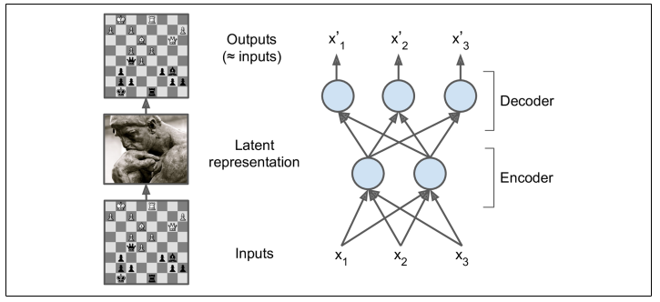
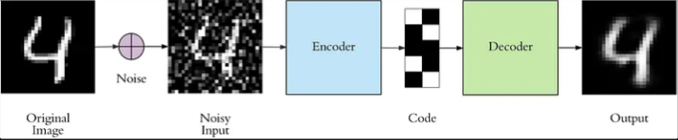
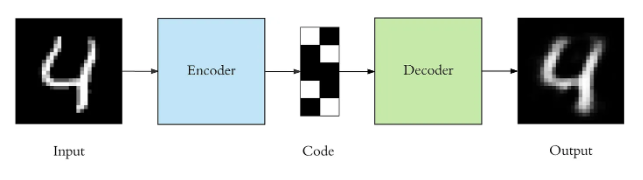
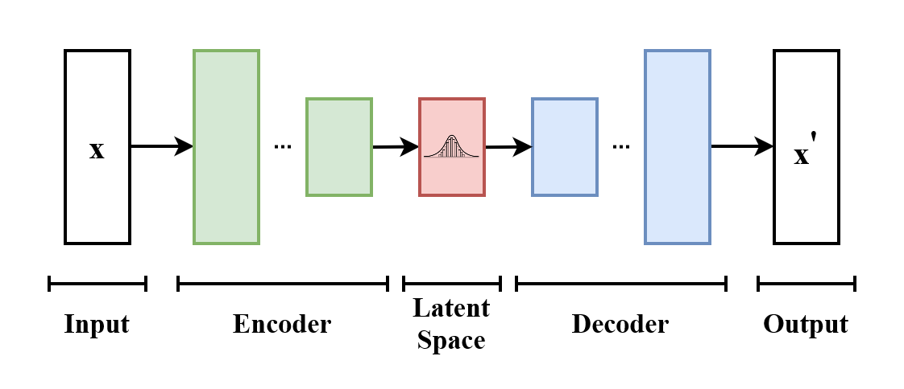
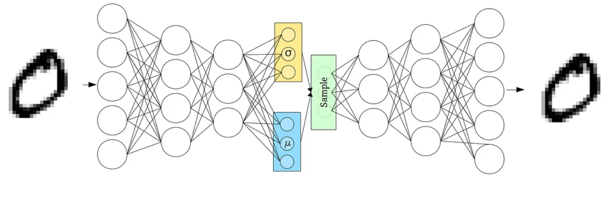
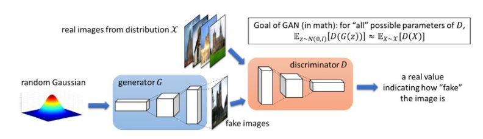

<!-- _class: lead -->

# IPD434
## Autoencoders, VAE y GAN
### Representaciones latentes y modelos generativos

Dr. Nicolás Gálvez Ramírez 
Dr. Patricio Olivares Roncagliolo

---

## Conexión con redes neuronales

Una red supervisada aprende $x\mapsto y$. Un autoencoder aprende a reconstruir $x$ mediante una representación comprimida. Un modelo generativo intenta producir nuevas muestras.

$$
x\xrightarrow{encoder}z\xrightarrow{decoder}\hat x
$$

La representación latente es útil solo si la restricción impuesta evita que la red copie trivialmente la entrada.

En español también se utiliza “codificador automático”; aquí se mantiene *autoencoder* por ser el término predominante en las bibliotecas y referencias.

---

## Objetivos

1. **Explicar** encoder, espacio latente y decoder.
2. **Relacionar** restricciones del cuello de botella con representaciones útiles.
3. **Distinguir** AE determinista y VAE probabilístico.
4. **Formular** el juego adversarial de una GAN.
5. **Implementar** un autoencoder convolucional.
6. **Evaluar** reconstrucción y generación más allá de ejemplos visuales elegidos.

---

## Autoencoder

$$
z=f_\theta(x),\qquad \hat x=g_\phi(z)
$$

$$
(\theta^*,\phi^*)=\arg\min_{\theta,\phi}
\frac{1}{n}\sum_i\ell(x_i,g_\phi(f_\theta(x_i)))
$$

El cuello de botella puede ser dimensional, ruidoso, disperso o regularizado.

El encoder aprende qué información conservar en $z$ y el decoder aprende cómo reconstruirla. La pérdida $\ell$ determina qué diferencias entre $x$ y $\hat x$ resultan importantes.

---

## ¿Qué puede aprender?

Aplicaciones del material base:

- reducción de dimensión;
- eliminación de ruido;
- detección de anomalías;
- compresión;
- preentrenamiento o extracción de características.

Error de reconstrucción alto no implica automáticamente anomalía: puede reflejar una región poco representada, un cambio de adquisición o capacidad insuficiente.

Para usarlo como detector, el umbral debe calibrarse con ejemplos normales y anómalos separados del conjunto de prueba final.

---

## Autoencoder para eliminación de ruido

Se corrompe la entrada $\tilde x$ y se reconstruye la muestra limpia:

$$
\hat x=g_\phi(f_\theta(\tilde x)),\qquad
L=\ell(x,\hat x)
$$

La corrupción obliga a modelar estructura estable en vez de identidad exacta.

El tipo y la intensidad del ruido deben representar perturbaciones plausibles; un ruido artificial poco realista puede enseñar una invariancia inútil.

---

## Autoencoder convolucional

Para imágenes, las convoluciones preservan la estructura espacial.

**Encoder**

- `Conv2D`.
- Reducción espacial.
- Aumento de canales.

**Decoder**

- `Conv2DTranspose` o upsampling.
- Recuperación espacial.
- Salida compatible con píxeles.

La pérdida puede ser MSE o entropía cruzada según el modelo de observación.

La salida debe recuperar la forma original. Una activación sigmoide es coherente cuando los píxeles se normalizan al intervalo $[0,1]$.

---

## Limitación del AE determinista

Un AE asigna cada entrada a un punto $z$, pero no obliga al espacio latente a ser continuo o fácil de muestrear.

Interpolar o muestrear puntos arbitrarios puede producir decodificaciones sin significado.

Los VAE agregan una distribución latente y regularización explícita.

El problema no es reconstruir datos observados, sino asegurar que regiones completas del espacio latente correspondan a salidas plausibles.

---

## Variational Autoencoder

El encoder aproxima:

$$
q_\phi(z\mid x)=\mathcal N(\mu_\phi(x),\operatorname{diag}(\sigma_\phi^2(x)))
$$

y el decoder modela $p_\theta(x\mid z)$.

En vez de producir un único código, el encoder genera los parámetros $\mu$ y $\sigma$ de una distribución desde la cual se obtiene $z$.

---

## Objetivo del VAE

Se maximiza una cota inferior de evidencia (ELBO):

$$
\mathcal L_{ELBO}=
\mathbb E_{q_\phi(z\mid x)}[\log p_\theta(x\mid z)]
-D_{KL}(q_\phi(z\mid x)\|p(z))
$$

- Primer término: calidad de reconstrucción.
- Segundo término: regularidad del espacio latente.

El término KL acerca la distribución aproximada al prior $p(z)$, normalmente $\mathcal N(0,I)$. Aumentarlo demasiado puede deteriorar la reconstrucción.

---

## Truco de reparametrización

Para propagar gradientes a través del muestreo:

$$
\epsilon\sim\mathcal N(0,I),\qquad
z=\mu+\sigma\odot\epsilon
$$

La aleatoriedad queda en $\epsilon$ y $z$ se expresa como una función diferenciable de $\mu$ y $\sigma$.

De esta forma, el muestreo no bloquea el cálculo de gradientes respecto de los parámetros del encoder.

---

## Generative Adversarial Network

- Generador $G(z)$: transforma ruido en muestras.
- Discriminador $D(x)$: distingue reales de generadas.

$$
\min_G\max_D
\mathbb E_{x\sim p_{data}}[\log D(x)]
+\mathbb E_{z\sim p(z)}[\log(1-D(G(z)))]
$$

$D(x)$ estima si una muestra parece real y $G(z)$ intenta generar muestras que reciban un valor alto. Ambos modelos se entrenan con objetivos opuestos.

---

## Entrenamiento adversarial

1. Muestrear datos reales y ruido.
2. Actualizar $D$ para separar reales y falsos.
3. Congelar $D$ durante el paso del generador.
4. Actualizar $G$ para producir muestras que $D$ clasifique como reales.
5. Repetir manteniendo equilibrio entre ambos.

La pérdida del generador suele usar $-\log D(G(z))$ para obtener gradientes más fuertes al inicio.

Si el discriminador aprende demasiado rápido, puede entregar poca señal útil al generador; si es demasiado débil, tampoco guía la mejora de las muestras.

---

## Dificultades de GAN

- Inestabilidad y oscilación.
- Colapso de modos.
- Gradientes débiles.
- Alta sensibilidad a arquitectura e hiperparámetros.
- Evaluación visual sesgada por selección de muestras.

Calidad y diversidad son dimensiones distintas: generar una imagen convincente no demuestra haber aprendido toda la distribución.

---

## Evaluación

| Modelo | Métricas posibles | Pregunta |
|---|---|---|
| AE | MSE, SSIM, error por segmento | ¿Reconstruye lo relevante? |
| Detección | AUROC, PR-AUC, exhaustividad a FPR fija | ¿Separa anomalías reales? |
| Generativo | FID, precisión y exhaustividad generativas | ¿Hay calidad y cobertura? |
| Representación | Desempeño en una tarea posterior | ¿El latente sirve para otra tarea? |

La evaluación debe usar un conjunto independiente y una línea base.

FID compara estadísticas de características entre datos reales y generados; no reemplaza la inspección de diversidad ni el análisis del dominio.

---

## Ejemplo ejecutable

[`notebooks/05_3_autoencoder_convolucional.ipynb`](notebooks/05_3_autoencoder_convolucional.ipynb):

- carga MNIST y agrega ruido;
- entrena un autoencoder convolucional;
- compara entrada ruidosa, reconstrucción y objetivo;
- calcula error por imagen;
- propone convertir el error en detector y calibrar un umbral.

---

## Síntesis

- AE aprende una representación mediante reconstrucción restringida.
- Denoising AE aprende invariancia a una corrupción definida.
- VAE regulariza una distribución latente mediante KL.
- GAN enfrenta generador y discriminador en un juego minimax.
- Evaluar requiere calidad, diversidad, utilidad y análisis por segmento.

La última especialidad revisa cómo entrenar CNN profundas mediante conexiones residuales, módulos multi-escala y escalamiento eficiente.

---

## Referencias

- Material original: `05-3_GAN_AE.ipynb`.
- D. P. Kingma y M. Welling, “Auto-Encoding Variational Bayes”, 2014.
- I. Goodfellow et al., “Generative Adversarial Nets”, 2014.
- Keras, ejemplos oficiales de VAE y autoencoder convolucional.
