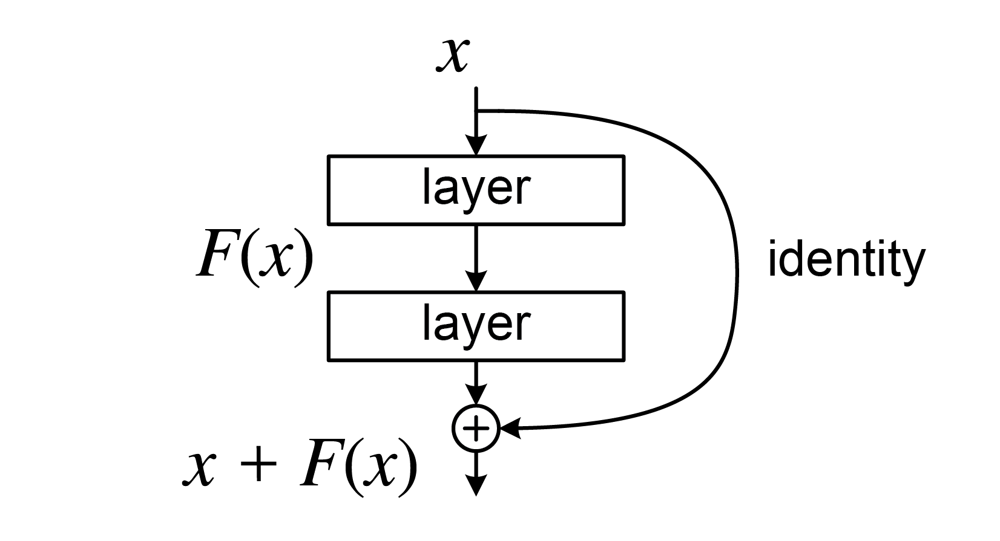
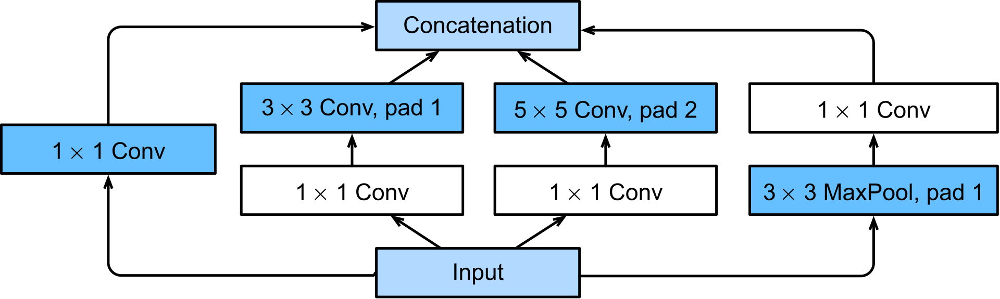

<!-- _class: lead -->

# IPD434
## Arquitecturas CNN avanzadas
### Profundidad, multi-escala y eficiencia

Dr. Nicolás Gálvez Ramírez 
Dr. Patricio Olivares Roncagliolo

---

## Conexión con la unidad base

Una CNN básica aprende filtros locales y reduce la resolución espacial. Aumentar la profundidad mejora la capacidad, pero dificulta la optimización y eleva el costo.

Esta unidad compara tres respuestas:

- ResNet: rutas residuales para entrenar redes profundas.
- Inception: procesamiento paralelo a varias escalas.
- EfficientNet: escalamiento coordinado de profundidad, ancho y resolución.

---

## Objetivos

1. **Explicar** degradación, vanishing y exploding gradients.
2. **Formular** una conexión residual.
3. **Describir** un módulo Inception y sus ramas.
4. **Interpretar** el escalamiento compuesto de EfficientNet.
5. **Aplicar** normalización por lotes, aumento de datos y regularización.
6. **Comparar** arquitecturas bajo métricas de calidad y costo.

---

## Profundidad y campo receptivo

Apilar convoluciones aumenta el campo receptivo efectivo y permite composiciones jerárquicas:

$$
\text{bordes}\rightarrow\text{texturas}\rightarrow
\text{partes}\rightarrow\text{objetos}
$$

Sin embargo, una red más profunda puede obtener mayor error de entrenamiento si la optimización se degrada. Eso no es el mismo fenómeno que sobreajuste.

El campo receptivo indica qué región de la entrada puede influir en una activación. Aumentarlo permite integrar contexto, pero también incrementa el costo y la dificultad de entrenamiento.

---

## Vanishing y exploding gradients

En una composición profunda:

$$
\frac{\partial L}{\partial h_l}
=\frac{\partial L}{\partial h_L}
\prod_{k=l}^{L-1}\frac{\partial h_{k+1}}{\partial h_k}
$$

El producto de Jacobianos puede tender a cero o crecer sin control.

Si las derivadas se desvanecen, las primeras capas reciben una señal de aprendizaje mínima; si explotan, las actualizaciones pueden volverse numéricamente inestables.

Mitigaciones:

- inicialización adecuada;
- activaciones apropiadas;
- normalización;
- conexiones residuales;
- recorte del gradiente en contextos que lo requieran.

---

## Bloque residual

$$
y=F(x;W)+x
$$

En vez de aprender directamente $H(x)$, el bloque aprende el residuo:

$$
F(x)=H(x)-x
$$

La identidad ofrece una ruta corta para activaciones y gradientes.

Si la transformación adicional no ayuda, el bloque puede aproximar la identidad haciendo $F(x)\approx0$. Esto facilita incorporar profundidad sin obligar a cada bloque a reaprender la entrada completa.

---

## Cuando cambian las dimensiones

Si $F(x)$ y $x$ no tienen la misma forma, se proyecta el atajo:

$$
y=F(x;W)+W_sx
$$

Una convolución $1\times1$ puede ajustar canales y resolución mediante un paso (*stride*) mayor que uno.

La suma residual exige dimensiones compatibles; una implementación que las fuerza sin justificar el paso o la proyección cambia la arquitectura.

---

## Qué aporta ResNet

- Facilita la optimización de redes profundas.
- Permite bloques identidad o de proyección.
- Reutiliza características mediante sumas.
- Sirve como red base (*backbone*) para clasificación, detección y segmentación.

No elimina automáticamente el sobreajuste ni el costo: la profundidad, los datos y la regularización siguen siendo decisiones experimentales.

---

## Módulo Inception

Procesa la misma entrada con ramas paralelas:

- convolución $1\times1$;
- convolución $3\times3$;
- convolución $5\times5$ o su factorización;
- agrupación (*pooling*) y proyección.

Las salidas se concatenan por canales.

Las ramas permiten observar simultáneamente patrones de distinta escala. Las proyecciones $1\times1$ limitan el número de canales antes de las operaciones más costosas.

---

## Convolución $1\times1$

Una convolución $1\times1$ combina canales sin mezclar posiciones espaciales:

$$
y_{i,j,c'}=\sum_c W_{c',c}x_{i,j,c}+b_{c'}
$$

Antes de filtros costosos puede reducir canales y operaciones. Después puede proyectar representaciones a otro ancho.

Aunque el filtro cubre un solo píxel espacial, combina toda la profundidad de canales y aprende nuevas mezclas de características.

---

## EfficientNet y escalamiento compuesto

En vez de escalar una sola dimensión:

$$
d=\alpha^\phi,\qquad
w=\beta^\phi,\qquad
r=\gamma^\phi
$$

sujeto aproximadamente a:

$$
\alpha\beta^2\gamma^2\approx2,\qquad
\alpha,\beta,\gamma\ge1
$$

donde $d$, $w$ y $r$ representan profundidad, ancho y resolución.

$\phi$ fija el nivel global de escalamiento. La restricción aproxima una duplicación del costo al aumentar $\phi$ en una unidad.

---

## Bloque MBConv

EfficientNet usa bloques móviles invertidos:

1. expansión $1\times1$;
2. convolución por canal (*depthwise*);
3. atención de canales (*squeeze-and-excitation*);
4. proyección $1\times1$;
5. atajo cuando las dimensiones coinciden.

Una convolución separable por profundidad reduce las operaciones frente a una convolución densa convencional: primero filtra cada canal y luego combina los canales con una proyección $1\times1$.

---

## Normalización por lotes

Para un mini-lote:

$$
\hat x=\frac{x-\mu_B}{\sqrt{\sigma_B^2+\epsilon}},\qquad
y=\gamma\hat x+\beta
$$

Durante inferencia se usan estadísticas acumuladas, no las del lote actual.

La normalización por lotes puede estabilizar el entrenamiento, pero su comportamiento depende del tamaño del lote y del modo de entrenamiento o inferencia.

---

## Aumento de datos

Las transformaciones que preservan la etiqueta amplían la distribución de entrenamiento:

- reflexiones cuando la orientación no define la clase;
- traslación, recorte o rotación limitada;
- cambios fotométricos;
- enmascaramiento regional, como *Cutout* o *Random Erasing*.

Una transformación es válida solo si conserva el significado en el dominio. Voltear una radiografía o un carácter puede cambiar su interpretación.

---

## Mixup

Se mezclan pares de muestras y etiquetas:

$$
\tilde x=\lambda x_i+(1-\lambda)x_j
$$

$$
\tilde y=\lambda y_i+(1-\lambda)y_j,\qquad
\lambda\sim\operatorname{Beta}(\alpha,\alpha)
$$

Mixup favorece transiciones más suaves entre clases, pero cambia la distribución de entrenamiento y debe validarse en la tarea destino.

Cuando $\lambda$ está cerca de $1$, predomina la primera muestra; cerca de $0.5$, ambas contribuyen de forma semejante.

---

## Suavizado de etiquetas

Para $K$ clases, una etiqueta one-hot se reemplaza por:

$$
y'_k=(1-\varepsilon)y_k+\frac{\varepsilon}{K}
$$

Reduce objetivos excesivamente confiados y puede mejorar generalización. No garantiza calibración: esta debe medirse por separado.

La masa $\varepsilon$ se distribuye entre todas las clases, de modo que la clase correcta deja de tener un objetivo exactamente igual a $1$.

---

## Transferencia de aprendizaje

Flujo recomendado:

1. Cargar una red base preentrenada sin cabeza.
2. Aplicar el preprocesamiento específico de la arquitectura.
3. Congelar la red base y entrenar una nueva cabeza.
4. Descongelar parcialmente con tasa de aprendizaje menor.
5. Reevaluar validación y costo.

ResNet requiere su `preprocess_input`; EfficientNet incluye reescalamiento en el modelo actual de Keras.

---

## Comparar arquitecturas

| Dimensión | Métrica posible |
|---|---|
| Calidad | Exactitud, macro-$F_1$, error por clase |
| Tamaño | Número de parámetros, MB |
| Cómputo | FLOPs o MACs |
| Servicio | Latencia $p50/p95$, rendimiento por unidad de tiempo |
| Energía | Joules por inferencia |
| Robustez | Desempeño bajo perturbación o cambio de dominio |

La arquitectura con mayor exactitud no siempre es la mejor para despliegue.

---

## Ejemplo ejecutable

[`notebooks/05_4_bloque_residual.ipynb`](notebooks/05_4_bloque_residual.ipynb):

- implementa un bloque residual con API funcional de Keras;
- entrena una CNN pequeña sobre un subconjunto de CIFAR-10;
- compara curva de validación y parámetros;
- deja fijo el presupuesto de épocas y datos.

El ejemplo es didáctico; no pretende reproducir ResNet50.

---

## Síntesis

- Conexiones residuales crean rutas de identidad para redes profundas.
- Inception combina escalas mediante ramas paralelas.
- EfficientNet coordina profundidad, ancho y resolución.
- La normalización y el aumento de datos afectan la optimización y la generalización.
- La selección de arquitectura debe incluir costo, latencia y robustez.

Con esta unidad se cierra el recorrido: desde complejidad e imprecisión hasta búsqueda, aprendizaje y arquitecturas especializadas.

---

## Referencias

- Material original: `05-4_AdvancedCNNArchitectures.ipynb`.
- K. He et al., “Deep Residual Learning for Image Recognition”, 2016.
- C. Szegedy et al., “Going Deeper with Convolutions”, 2015.
- M. Tan y Q. Le, “EfficientNet: Rethinking Model Scaling for CNNs”, 2019.
- Keras, documentación oficial de ResNet y EfficientNet.
